# CHAPTER 4. DIAGNOSTIC CAPABILITIES OF THE HPF-P INTELLIGENT DECISION-MAKING PLATFORM IN FORMING EFFECTIVE PHARMACEUTICAL PORTFOLIOS

## Chapter Overview

This chapter presents the production implementation of the Holistic Portfolio Framework as the **HPF-P platform** (*Holistic Portfolio Framework — Platform*) — a software system that operationalises the theoretical constructs of the Decision Readiness Index (DRI) and Decision Readiness Levels (DRL) developed in Chapters 1 and 2 into an executable, auditable decision-support pipeline for pharmaceutical SKU portfolio management. The chapter proceeds from architectural description through operational technology to scenario-based experimental validation using real-company datasets for Darnitsa and Farmak.

The central argument is not merely that HPF-P produces superior portfolio allocations — though the quantitative evidence confirms it does — but that it embodies a coherent *economic epistemology*: the system withholds optimisation when optimisation is not yet economically admissible, applies estimation methods whose complexity is proportional to demonstrated informational readiness, and produces every recommendation with a traceable chain of diagnostic justification. This architecture distinguishes HPF-P from optimisation tools that assume data sufficiency and proceed regardless of information quality.

---

## 4.1 Architecture of the HPF-P Decision Platform

### 4.1.1 Architectural Problem Statement

The pharmaceutical portfolio management problem confronting Ukrainian manufacturers is not, in its deepest form, an optimisation problem. It is an *admissibility* problem: determining which analytical methods are economically justified given the quality of available information. Ukrainian pharmaceutical firms — Farmak, Darnitsa, Arterium, Yuria-Pharm — operate commercial SKU portfolios of 12 to 25 items subject to regulatory price controls, seasonal demand variation, war-induced supply disruptions, and structural breaks in consumption patterns. The data environments they manage are characterised by partial observability: censored demand records, missing price histories, irregular reporting periods, and regime shifts that invalidate stationarity assumptions.

Existing portfolio optimisation platforms respond to this environment by treating data quality as a precondition established externally, prior to use. The platform user is implicitly assumed to have validated that their data is sufficient for the chosen method. HPF-P inverts this assumption: data quality validation is an internal, computable step of the analytical pipeline, and the choice of optimisation method is a *consequence* of that validation, not a user-level input.

Formally, HPF-P solves the following allocation problem: given a set of N SKU candidates, determine the optimal percentage allocation of investment resources to M ≤ N SKUs that maximises expected revenue while satisfying regulatory, institutional, and portfolio-structural constraints — and, critically, that determines which of several optimisation methods is economically admissible for each SKU given that SKU's informational state.

### 4.1.2 Eight-Module Pipeline Architecture

HPF-P implements the diagnostic-gated analytical pipeline as a sequential eight-module computation:

$$\text{Input}(\text{CSV} + \text{JSON}) \to M_1 \to M_2 \to M_3 \to M_4 \to M_5 \to M_{5b} \to M_6$$

where each module receives outputs of all predecessors and the pipeline transitions $M_2 \to M_3 \to M_4$ are *conditional*: modules M3 through M6 operate exclusively on SKUs that have passed the diagnostic validation of M1 and M2. SKUs that fail this gate are routed to ABSTAIN_HOLD — a legitimate, economically rational outcome documented in the system output as a constraint acknowledgement rather than a computational failure.

```mermaid
flowchart TD
    IN["📂 INPUT\ndata.csv + metadata.json"]:::input

    M1["M1 — Data Ingestion & Validation\n• Schema check → HTTP 400 if invalid\n• SKU cross-reference (CSV ∩ JSON)\n• Type coercion & 3-stage imputation\n• Compute ρ_miss before imputation\n• Quality flag: OK / DATA_QUALITY=POOR"]:::module

    M2["M2 — DRI Computation & DRL Assignment\n• R₁ Completeness  · w=0.25\n• R₂ Demand Signal  · w=0.25\n• R₃ Tail Risk       · w=0.20\n• R₄ Regulatory      · w=0.15\n• R₅ Temporal Stab.  · w=0.15\n→ DRI ∈ [0,1] → DRL ∈ {1…5}"]:::module

    GATE{"DRI Gate\nDRL ≥ 2?"}:::gate

    ABSTAIN["ABSTAIN_HOLD\nDRL-1: DRI < 0.25\nPreserve status quo\n[documented outcome]"]:::abstain

    M3["M3 — ML Estimation\n• Fourier demand forecast (K=2 harmonics)\n• Log-log elasticity OLS\n• Risk score = 0.5·vol + 0.5·tail_ratio\n• Falls back to metadata prior if\n  data conditions insufficient"]:::module

    M4["M4 — Multi-Strategy Optimisation\n• 8 strategies compete:\n  1/N · DRL-Grouped · Momentum\n  DRI-Weighted · Risk-Parity\n  Profit-Max · Mean-Variance · Ensemble\n• 200-iter Monte Carlo evaluation\n• Best strategy selected empirically"]:::module

    M5["M5 — Portfolio Risk Simulation\n• 1 000 iterations\n• Demand ~ N(q̂, σ̂), Price ~ N(p̄, 0.05p̄)\n• Computes VaR₉₅ and CVaR₉₅"]:::module

    M5b["M5b — Time-Series Revenue Simulation\n• 500 paths × 12-month horizon\n• 3 scenarios: Historical / Baseline / HPF\n• P10 / P50 / P90 bands\n• Sharpe, Sortino, Calmar, drawdown\n• Probability of outperformance"]:::module

    M6["M6 — Output Assembly\n• Per-SKU weights + DRI + strategy\n• Economic comparison table\n• Audit trail (UUID, SHA-256, seed)\n• Natural-language narrative"]:::module

    OUT["📊 OUTPUT — Structured JSON\nportfolio_weights · per_sku_forecasts\nsimulation_results · audit_trail"]:::output

    IN --> M1 --> M2 --> GATE
    GATE -- "DRL = 1" --> ABSTAIN
    GATE -- "DRL ≥ 2" --> M3 --> M4 --> M5 --> M5b --> M6 --> OUT

    classDef input fill:#dbeafe,stroke:#2563eb,color:#1e3a5f,font-weight:bold
    classDef module fill:#f0fdf4,stroke:#16a34a,color:#14532d
    classDef gate fill:#fef9c3,stroke:#ca8a04,color:#713f12,font-weight:bold
    classDef abstain fill:#fef2f2,stroke:#dc2626,color:#7f1d1d
    classDef output fill:#f5f3ff,stroke:#7c3aed,color:#3b0764,font-weight:bold
```

*Figure 4.1. HPF-P eight-module pipeline with conditional DRI-governed transitions. Modules M3–M6 execute only for SKUs passing the DRL ≥ 2 gate; DRL-1 SKUs receive the ABSTAIN_HOLD outcome, a documented scientific result rather than a computational failure.*

**Module M1 — Data Ingestion and Validation** parses the CSV time-series input and JSON metadata, validates schema compliance, cross-references SKU identifiers between both sources, applies three-stage imputation for missing values (linear interpolation → forward fill → backward fill), and computes per-SKU quality flags including the raw missingness ratio $\rho_{\text{miss}}$. Critically, $\rho_{\text{miss}}$ is computed and recorded *before* imputation, preserving the true observational state for DRI computation. A SKU missing from either the CSV or the metadata is excluded from the analytical pipeline; neither source alone is sufficient.

**Module M2 — DRI Computation and DRL Assignment** evaluates five diagnostic dimensions (R₁ through R₅) for each SKU and assigns the Decision Readiness Level that governs all downstream analytical decisions. The DRI formula and dimension specifications are presented in Section 4.1.4.

**Module M3 — ML Estimation** fits Fourier-augmented demand forecasting models, estimates price elasticity via log-log regression, and computes per-SKU risk scores combining revenue volatility and tail-risk measures. ML methods are deployed here exclusively as *estimation instruments* — not decision-makers — and are constrained by admissibility conditions derived from M2 outputs.

**Module M4 — Multi-Strategy Portfolio Optimisation** generates portfolio weights under eight distinct strategies and selects the empirically best-performing strategy via rapid Monte Carlo evaluation (200 iterations per strategy). Strategy selection is deterministic and data-driven, replacing *a priori* methodological commitment with empirical performance comparison under current data conditions.

**Module M5 — Monte Carlo Risk Simulation** executes 1,000-iteration stochastic simulation to produce portfolio-level risk metrics: VaR₉₅, CVaR₉₅, and return distribution statistics.

**Module M5b — Time-Series Revenue Simulation** projects 12-month revenue trajectories across 500 simulation paths for three scenarios (historical baseline, equal-weight baseline, HPF-optimised), calibrated to the last observed revenue point, with P10/P50/P90 percentile bands and a comprehensive set of economic comparison metrics.

**Module M6 — Output Assembly** aggregates all module outputs into a structured JSON response with per-SKU diagnostics, portfolio metrics, strategy competition results, economic comparison tables, and a natural-language narrative summary.

### 4.1.3 Deployment Architecture

HPF-P operates as a three-tier web application deployed on a single Linux server (Ubuntu 24 LTS):

The **Backend API tier** comprises a FastAPI application (Python 3.12) running as a systemd service (`hpf-app`) on port 8901. The API exposes three endpoints: `/api/health` (liveness check), `/api/sample` (demonstration data delivery), and `/api/analyze` (full pipeline execution). The backend implements the entire analytical pipeline in pure Python, using an open-source scientific computing stack described in Section 4.1.7.

The **Frontend presentation tier** consists of an inline WordPress page served via the `hpf-project.php` mu-plugin, providing Chart.js-based interactive visualisation, scenario management controls, and predefined scenario data for five Ukrainian pharmaceutical company profiles delivered via `/wp-content/uploads/hpf-samples.js`. This tier also implements a client-side scenario engine with DRI computation and portfolio simulation capabilities for zero-latency interactive exploration.

The **Reverse proxy tier** employs Apache HTTP Server to proxy requests from the `/hpf/` URL path to `localhost:8901`, providing TLS termination, access logging, and integration with the broader research portal at `stabilarity.com`.

This topology enables HPF-P to function simultaneously as a research instrument supporting academic validation and a demonstration platform accessible to non-technical pharmaceutical industry stakeholders through a standard web browser, without requiring software installation or API credentials.

### 4.1.4 Input Data Contracts

The platform architecture reflects a fundamental epistemological principle: *transactional data provides what happened; metadata encodes what is known about the decision environment.* This separation is not merely technical — it is the mechanism by which the DRI computation diagnoses discrepancies between claimed and observed data quality.

**The CSV time-series contract** requires four fields and accepts two optional fields:

| Column | Type | Required | Description |
|---|---|---|---|
| `date` | ISO 8601 | Yes | Month of observation |
| `sku_id` | string | Yes | Unique identifier matching metadata keys |
| `quantity` | float | Yes | Units sold (≥ 0) |
| `revenue` | float | Yes | Revenue in UAH |
| `price` | float | No | Unit price (derived as revenue/quantity if absent) |
| `marketing_spend` | float | No | Promotional expenditure |

*Table 4.1. CSV input data contract for HPF-P.*

**The metadata JSON contract** specifies the complete decision environment: company identification, currency, reimbursement model, portfolio rules (weight bounds, abstention policy), and per-SKU attributes including operational status, demand observability, economic parameters (gross margin, price elasticity), and individual allocation bounds. The full metadata schema is reproduced in Appendix A.

The validation pipeline in M1 applies the following sequence: schema validation (absent required fields trigger HTTP 400 with field-level diagnostics), cross-referencing (only SKUs present in *both* sources proceed), type coercion, conservative imputation, and quality flagging. The raw missingness ratio before imputation is the critical output, as it feeds directly into DRI computation.

### 4.1.5 DRI Computation Engine

The Decision Readiness Index for SKU $s$ is defined as:

$$\text{DRI}(s) = w_1 \cdot R_1(s) + w_2 \cdot R_2(s) + w_3 \cdot R_3(s) + w_4 \cdot R_4(s) + w_5 \cdot R_5(s)$$

with dimension weights and interpretations as follows:

| Dimension | Symbol | Weight | Economic Interpretation |
|---|---|---|---|
| Data Completeness | R₁ | 0.25 | Observability of key economic variables |
| Demand Signal Strength | R₂ | 0.25 | Identifiability of market response |
| Tail Risk Observability | R₃ | 0.20 | Visibility of downside outcomes |
| Regulatory Feasibility | R₄ | 0.15 | Institutional stability and compliance |
| Temporal Stability | R₅ | 0.15 | Preservation of economic relationships over time |

*Table 4.2. DRI dimension weights and economic interpretations.*

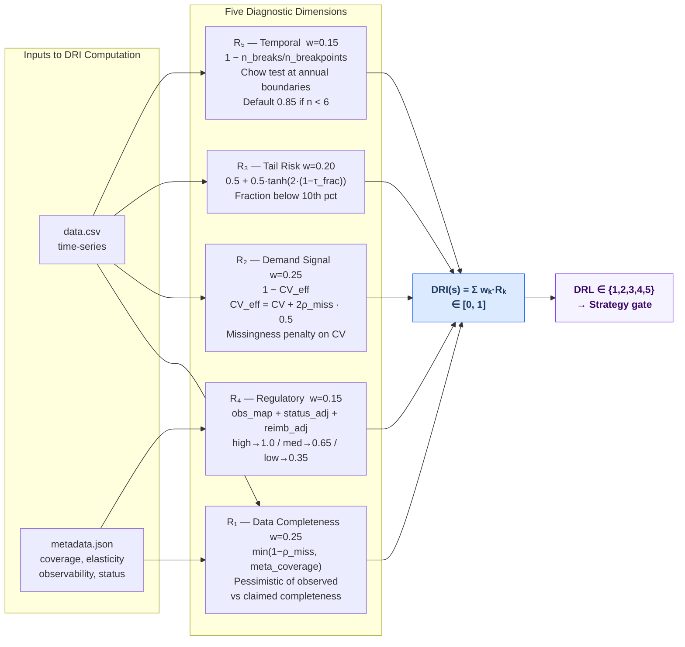
```mermaid
flowchart LR
    subgraph INPUTS["Inputs to DRI Computation"]
        CSV2["data.csv\ntime-series"]
        META["metadata.json\ncoverage, elasticity\nobservability, status"]
    end

    subgraph DIMS["Five Diagnostic Dimensions"]
        R1["R₁ — Data Completeness  w=0.25\nmin(1−ρ_miss, meta_coverage)\nPessimistic of observed\nvs claimed completeness"]
        R2["R₂ — Demand Signal  w=0.25\n1 − CV_eff\nCV_eff = CV + 2ρ_miss · 0.5\nMissingness penalty on CV"]
        R3["R₃ — Tail Risk  w=0.20\n0.5 + 0.5·tanh(2·(1−τ_frac))\nFraction below 10th pct"]
        R4["R₄ — Regulatory  w=0.15\nobs_map + status_adj + reimb_adj\nhigh→1.0 / med→0.65 / low→0.35"]
        R5["R₅ — Temporal  w=0.15\n1 − n_breaks/n_breakpoints\nChow test at annual boundaries\nDefault 0.85 if n < 6"]
    end

    DRI["DRI(s) = Σ wₖ·Rₖ\n∈ [0, 1]"]:::dri
    DRL["DRL ∈ {1,2,3,4,5}\n→ Strategy gate"]:::drl

    CSV2 --> R1 & R2 & R3 & R5
    META --> R1 & R4
    R1 & R2 & R3 & R4 & R5 --> DRI --> DRL

    classDef dri fill:#dbeafe,stroke:#2563eb,color:#1e3a5f,font-weight:bold
    classDef drl fill:#f5f3ff,stroke:#7c3aed,color:#3b0764,font-weight:bold
```

*Figure 4.4. DRI computation flow. Each of the five dimensions draws on different combinations of observational data and institutional metadata, ensuring that self-reported claims cannot unilaterally inflate the diagnostic score.*, and consequently $\text{DRI} \in [0,1]$.

**R₁ — Data Completeness** takes the more pessimistic of two indicators:

$$R_1(s) = \min(1 - \rho_{\text{miss}}(s),\ \text{metadata\_coverage}(s))$$

where $\rho_{\text{miss}}$ is the pre-imputation missingness ratio and `metadata_coverage` is the `historical_coverage_ratio` declared in the JSON metadata. Taking the minimum ensures that neither self-reported metadata nor observed completeness alone can inflate the completeness assessment — a guard against optimistic self-reporting.

**R₂ — Demand Signal Strength** uses an imputation-adjusted coefficient of variation:

$$\text{CV}_{\text{eff}}(s) = \text{CV}(s) + \min(2\rho_{\text{miss}},\ 1) \cdot 0.5$$

$$R_2(s) = \text{clip}(1 - \text{CV}_{\text{eff}}(s),\ 0,\ 1)$$

The missingness penalty is economically motivated: linear interpolation artificially reduces observed variance, which would overstate demand signal strength if the raw CV were used. The penalty reintroduces uncertainty proportional to the degree of imputation.

**R₃ — Tail Risk Observability** uses a hyperbolic tangent transformation of the fraction of demand observations below the 10th percentile:

$$R_3(s) = 0.5 + 0.5 \cdot \tanh(2 \cdot (1 - \tau_{\text{frac}}(s)))$$

This smooth scoring penalises heavy-tailed distributions where downside risk cannot be reliably assessed.

**R₄ — Regulatory and Constraint Feasibility** integrates three institutional signals via a clipped sum:

$$R_4(s) = \text{clip}\bigl(\text{obs\_map}(s) + \text{status\_adj}(s) + \text{reimb\_adj}(s),\ 0,\ 1\bigr)$$

where the observability mapping assigns {high → 1.0, medium → 0.65, low → 0.35}, SKUs with `status = "discontinuing"` receive a 0.15 penalty, and public reimbursement models receive a 0.10 bonus reflecting price transparency.

**R₅ — Temporal Stability** detects structural breaks using the Chow test applied at annual segment boundaries. For a series of $n$ observations with potential breakpoints at $t = 12k$, the test statistic is:

$$F = \frac{(\text{RSS}_{\text{full}} - \text{RSS}_{\text{restricted}}) / k}{\text{RSS}_{\text{restricted}} / (n - 2k)}$$

where $\text{RSS}_{\text{restricted}} = \text{RSS}_1 + \text{RSS}_2$ from segment-specific regressions. The stability score is:

$$R_5(s) = 1 - n_{\text{breaks}} / n_{\text{breakpoints}}$$

For series too short for breakpoint analysis (fewer than 6 observations), a conservative default $R_5 = 0.85$ is assigned, acknowledging limited temporal evidence without excessively penalising new SKUs.

### 4.1.6 DRL Assignment and Strategy Gating

The computed DRI score maps to one of five Decision Readiness Levels via threshold classification:

| DRL | DRI Range | Permitted Strategy | Economic Interpretation |
|---|---|---|---|
| 1 | < 0.25 | ABSTAIN_HOLD | Insufficient information; preserve status quo |
| 2 | [0.25, 0.45) | REVENUE_PROPORTIONAL | Minimal optimisation; proportional allocation |
| 3 | [0.45, 0.65) | CONSTRAINED_LP | Linear programming with hard constraints |
| 4 | [0.65, 0.80) | CVaR_MV | Mean-variance with risk controls |
| 5 | ≥ 0.80 | MULTI_OBJECTIVE_ML | Full multi-objective optimisation |

*Table 4.3. DRL thresholds, permitted strategies, and economic interpretations.*

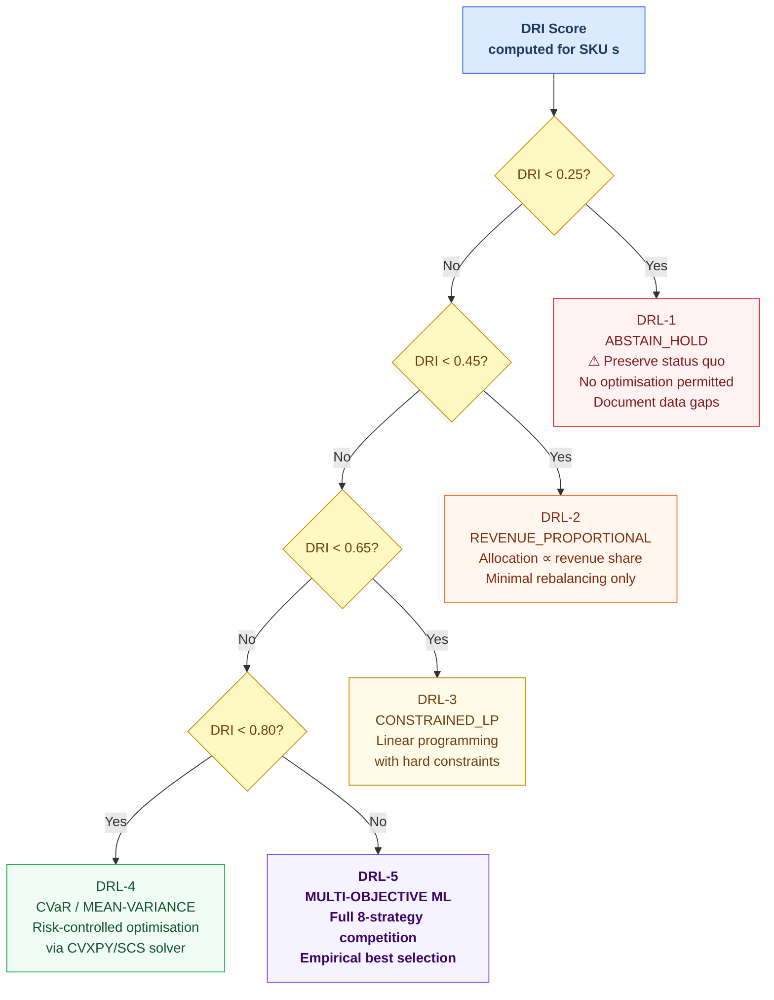
```mermaid
flowchart TD
    DRI_IN["DRI Score\ncomputed for SKU s"]:::input

    D1{"DRI < 0.25?"}:::gate
    D2{"DRI < 0.45?"}:::gate
    D3{"DRI < 0.65?"}:::gate
    D4{"DRI < 0.80?"}:::gate

    L1["DRL-1\nABSTAIN_HOLD\n⚠ Preserve status quo\nNo optimisation permitted\nDocument data gaps"]:::drl1
    L2["DRL-2\nREVENUE_PROPORTIONAL\nAllocation ∝ revenue share\nMinimal rebalancing only"]:::drl2
    L3["DRL-3\nCONSTRAINED_LP\nLinear programming\nwith hard constraints"]:::drl3
    L4["DRL-4\nCVaR / MEAN-VARIANCE\nRisk-controlled optimisation\nvia CVXPY/SCS solver"]:::drl4
    L5["DRL-5\nMULTI-OBJECTIVE ML\nFull 8-strategy competition\nEmpirical best selection"]:::drl5

    DRI_IN --> D1
    D1 -- Yes --> L1
    D1 -- No --> D2
    D2 -- Yes --> L2
    D2 -- No --> D3
    D3 -- Yes --> L3
    D3 -- No --> D4
    D4 -- Yes --> L4
    D4 -- No --> L5

    classDef input fill:#dbeafe,stroke:#2563eb,color:#1e3a5f,font-weight:bold
    classDef gate fill:#fef9c3,stroke:#ca8a04,color:#713f12
    classDef drl1 fill:#fef2f2,stroke:#dc2626,color:#7f1d1d
    classDef drl2 fill:#fff7ed,stroke:#ea580c,color:#7c2d12
    classDef drl3 fill:#fefce8,stroke:#ca8a04,color:#713f12
    classDef drl4 fill:#f0fdf4,stroke:#16a34a,color:#14532d
    classDef drl5 fill:#f5f3ff,stroke:#7c3aed,color:#3b0764,font-weight:bold
```

*Figure 4.3. DRL assignment decision tree. The DRI score gates access to progressively more sophisticated analytical methods; each level's strategy is the most complex method whose information requirements the DRI score satisfies.* the core HPF principle: analytical complexity is bounded by informational readiness. A SKU at DRL-1 cannot be optimised regardless of how sophisticated the optimiser is, because optimisation results are not economically interpretable under those informational conditions. The ABSTAIN_HOLD outcome for DRL-1 SKUs is not a computational failure; it is the economically correct response to informational inadequacy.

### 4.1.7 ML Estimation Module

Module M3 provides statistical estimates under well-specified admissibility conditions. For demand forecasting, HPF-P employs Fourier-augmented linear regression:

$$q_t = \beta_0 + \beta_1 t + \sum_{k=1}^{2} \left[\alpha_k \sin\!\left(\frac{2\pi k t}{12}\right) + \gamma_k \cos\!\left(\frac{2\pi k t}{12}\right)\right] + \varepsilon_t$$

This specification captures both linear trend and the first two annual harmonics of seasonality. Twelve-month forecasts are obtained by evaluating the fitted model at $t = n, n+1, \ldots, n+11$ with prediction interval estimation from the OLS residual distribution.

The deliberate choice of Fourier-augmented linear models over ARIMA or deep learning architectures reflects several admissibility considerations. These models require only $2K+2 = 6$ parameters for $K=2$ harmonics, enabling estimation with as few as 18–24 monthly observations; each coefficient carries direct economic meaning (trend slope, seasonal amplitude, phase); and unlike autoregressive models, they do not propagate imputation artefacts through lagged terms.

Price elasticity is estimated via log-log regression $\ln q_t = \alpha + \eta \ln p_t + \varepsilon_t$ when price variation is sufficient (standard deviation > $10^{-4}$) and at least 6 observations are available. When these admissibility conditions are not met, the system falls back to the metadata-provided elasticity — a disciplined application of the DRI principle that estimation should not be attempted under insufficient data conditions.

### 4.1.8 Multi-Strategy Portfolio Optimisation

Module M4 implements a competitive multi-strategy approach: eight distinct strategies generate portfolio weight vectors, each is evaluated via 200-iteration Monte Carlo, and the empirically best-performing strategy is selected. This design reflects the No Free Lunch theorem — no single optimisation method dominates across all data conditions — and replaces *a priori* methodological commitment with data-driven strategy selection.

The eight strategies span a spectrum from naive baselines to sophisticated multi-objective formulations:

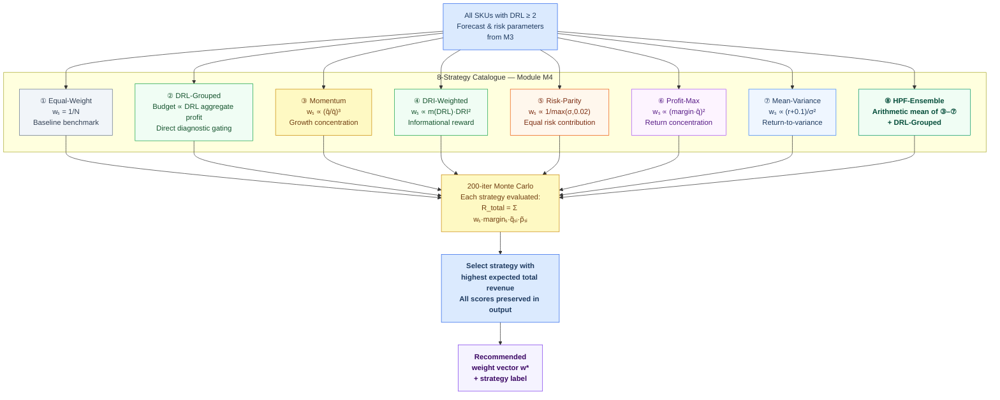
```mermaid
flowchart TD
    START["All SKUs with DRL ≥ 2\nForecast & risk parameters\nfrom M3"]:::input

    subgraph STRAT["8-Strategy Catalogue — Module M4"]
        S1["① Equal-Weight\nwₛ = 1/N\nBaseline benchmark"]:::naive
        S2["② DRL-Grouped\nBudget ∝ DRL aggregate profit\nDirect diagnostic gating"]:::dri_based
        S3["③ Momentum\nwₛ ∝ (q̂/q̄)³\nGrowth concentration"]:::momentum
        S4["④ DRI-Weighted\nwₛ ∝ m(DRL)·DRI²\nInformational reward"]:::dri_based
        S5["⑤ Risk-Parity\nwₛ ∝ 1/max(σ,0.02)\nEqual risk contribution"]:::risk
        S6["⑥ Profit-Max\nwₛ ∝ (margin·q̂)²\nReturn concentration"]:::profit
        S7["⑦ Mean-Variance\nwₛ ∝ (r+0.1)/σ²\nReturn-to-variance"]:::mv
        S8["⑧ HPF-Ensemble\nArithmetic mean of ③–⑦\n+ DRL-Grouped"]:::ensemble
    end

    MC["200-iter Monte Carlo\nEach strategy evaluated:\nR_total = Σ wₛ·marginₛ·q̃ₛᵢ·p̃ₛᵢ"]:::eval

    SELECT["Select strategy with\nhighest expected total revenue\nAll scores preserved in output"]:::select

    OUT2["Recommended\nweight vector w*\n+ strategy label"]:::output

    START --> S1 & S2 & S3 & S4 & S5 & S6 & S7 & S8
    S1 & S2 & S3 & S4 & S5 & S6 & S7 & S8 --> MC --> SELECT --> OUT2

    classDef input fill:#dbeafe,stroke:#2563eb,color:#1e3a5f
    classDef naive fill:#f1f5f9,stroke:#64748b,color:#334155
    classDef dri_based fill:#f0fdf4,stroke:#16a34a,color:#14532d
    classDef momentum fill:#fef9c3,stroke:#ca8a04,color:#713f12
    classDef risk fill:#fff7ed,stroke:#ea580c,color:#7c2d12
    classDef profit fill:#fdf4ff,stroke:#a855f7,color:#581c87
    classDef mv fill:#eff6ff,stroke:#3b82f6,color:#1e3a5f
    classDef ensemble fill:#f0fdf4,stroke:#059669,color:#064e3b,font-weight:bold
    classDef eval fill:#fef9c3,stroke:#ca8a04,color:#713f12
    classDef select fill:#dbeafe,stroke:#2563eb,color:#1e3a5f,font-weight:bold
    classDef output fill:#f5f3ff,stroke:#7c3aed,color:#3b0764,font-weight:bold
```

*Figure 4.7. Multi-strategy competition in Module M4. All eight strategies generate candidate weight vectors simultaneously; empirical Monte Carlo evaluation selects the best-performing method under current data conditions, implementing the No Free Lunch principle.* ($w_s = 1/N$): The 1/N benchmark, included because DeMiguel et al. (2009) demonstrated that naive diversification frequently outperforms optimised portfolios when estimation error dominates.

2. **DRL-Grouped**: Each DRL group receives a budget proportional to aggregate profit potential; within-group allocation follows the DRL-specific strategy. This is the only strategy that directly implements diagnostic gating.

3. **Momentum** ($w_s \propto (\hat{q}_s / \bar{q}_s)^3$): The cubic exponent concentrates allocation on high-growth SKUs, reflecting pharmaceutical demand persistence due to prescribing inertia and formulary lock-in.

4. **DRI-Weighted** ($w_s \propto m(\text{DRL}_s) \cdot \text{DRI}(s)^2$): Rewards informational adequacy, with DRL multipliers $m(\cdot) \in \{0.02, 0.2, 1.0, 2.5, 5.0\}$ for DRL levels 1–5.

5. **Risk-Parity** ($w_s \propto 1/\max(\sigma_s, 0.02)$): Equalises risk contribution across SKUs, providing a hedge against volatility concentration.

6. **Profit-Maximiser** ($w_s \propto (\text{margin}_s \cdot \hat{q}_s)^2$): Aggressively concentrates on top-performing SKUs when expected return dominates diversification concerns.

7. **Mean-Variance** ($w_s \propto \max(0.01, (r_s + 0.1)/\sigma_s^2)$): Return-to-variance weighting with an additive constant preventing zero weights for declining SKUs.

8. **HPF-Ensemble**: Arithmetic mean of strategies 3–7 and DRL-Grouped, providing natural diversification across optimisation philosophies.

After generating all eight weight vectors, the platform selects the strategy with the highest mean total revenue across 200 Monte Carlo iterations, with all strategy scores preserved in the output for comparative inspection.

### 4.1.9 Monte Carlo Simulation Engine

The full simulation engine (Module M5) executes 1,000 iterations with demand and price sampled from normal distributions centred on forecast values. From the empirical distribution of 1,000 portfolio return realisations, the platform computes:

- $\text{VaR}_{95}$: The 5th percentile of portfolio returns  
- $\text{CVaR}_{95}$: $\mathbb{E}[\tilde{R} \mid \tilde{R} \leq \text{VaR}_{95}]$ — expected return conditional on being in the worst 5% of outcomes

Module M5b projects 12-month revenue trajectories across 500 simulation paths for baseline (equal-weight) and HPF-optimised portfolios, with a calibration step ensuring both scenarios match the last observed historical revenue. The prediction line is the **median (P50)** across simulation paths — more robust to outliers than the mean — with uncertainty bands at P10 and P90.

The platform supports two reproducibility modes. In **deterministic mode** (default), the PRNG is seeded at base seed 42 with iteration $i$ using seed $42 + i$, guaranteeing identical outputs for identical inputs across all runs. In **stochastic mode**, a random base seed is generated per run, enabling sensitivity analysis while preserving within-run reproducibility. This dual-mode architecture addresses both the auditability requirements of regulatory compliance and the exploratory needs of scenario analysis.

Economic comparison metrics between baseline and HPF scenarios include: Sharpe ratio, Sortino ratio, Calmar ratio, VaR₉₅, CVaR₉₅, maximum drawdown (computed as median per-path maximum drawdown to avoid mean-path smoothing bias), probability of outperformance, breakeven month, and absolute and percentage revenue gain. The Sharpe ratio uses a 0.5% monthly risk-free rate proxy reflecting NBU policy rates during the study period.

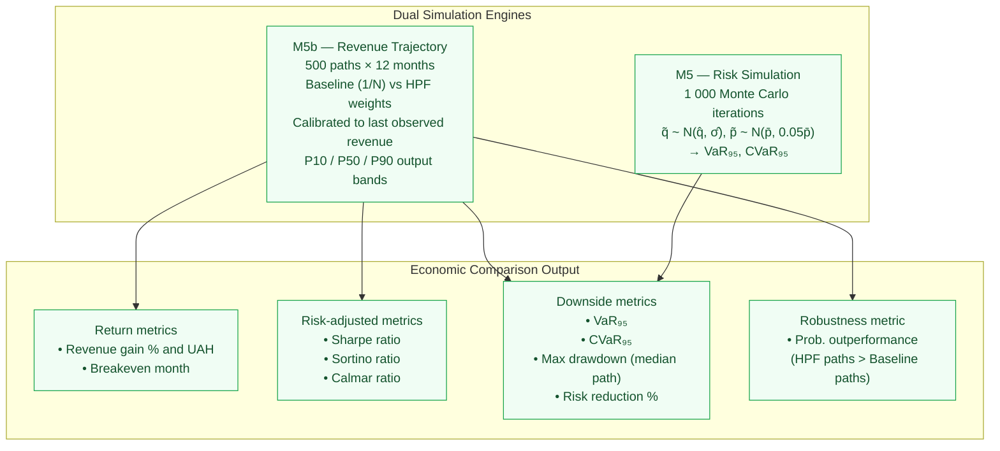
```mermaid
flowchart TD
    subgraph SIM["Dual Simulation Engines"]
        M5A["M5 — Risk Simulation\n1 000 Monte Carlo iterations\nq̃ ~ N(q̂, σ̂), p̃ ~ N(p̄, 0.05p̄)\n→ VaR₉₅, CVaR₉₅"]
        M5B2["M5b — Revenue Trajectory\n500 paths × 12 months\nBaseline (1/N) vs HPF weights\nCalibrated to last observed revenue\nP10 / P50 / P90 output bands"]
    end

    subgraph CMP["Economic Comparison Output"]
        direction LR
        C1["Return metrics\n• Revenue gain % and UAH\n• Breakeven month"]
        C2["Risk-adjusted metrics\n• Sharpe ratio\n• Sortino ratio\n• Calmar ratio"]
        C3["Downside metrics\n• VaR₉₅\n• CVaR₉₅\n• Max drawdown (median path)\n• Risk reduction %"]
        C4["Robustness metric\n• Prob. outperformance\n  (HPF paths > Baseline paths)"]
    end

    M5A --> C3
    M5B2 --> C1 & C2 & C3 & C4

    classDef default fill:#f0fdf4,stroke:#16a34a,color:#14532d
```

*Figure 4.9. Dual simulation engines and economic comparison metric derivation. M5 provides portfolio-level risk characterisation; M5b provides the full trajectory comparison across 500 independent paths. Median (P50) is used as the central estimate in preference to mean, avoiding smoothing bias.*

### 4.1.10 Technology Stack

HPF-P is built on an open-source scientific computing stack selected for mathematical rigour, audit transparency, and deployment simplicity:

| Library | Version | Role in HPF-P |
|---|---|---|
| **FastAPI** | 0.100+ | Asynchronous HTTP API framework |
| **NumPy** | 1.26+ | Array operations, random number generation |
| **Pandas** | 2.1+ | Time-series management, CSV parsing |
| **SciPy** | 1.11+ | Statistical distributions, linear programming |
| **statsmodels** | 0.14+ | OLS regression, Fourier demand models, Chow test |
| **CVXPY** | 1.4+ | Convex optimisation for DRL-4 and DRL-5 problems |
| **Pydantic** | 2.0+ | Request/response validation and serialisation |

*Table 4.4. HPF-P backend technology stack.*

The choice of CVXPY with the SCS solver for portfolio optimisation reflects a priority for *mathematical guarantees*: SCS provides convergence certificates for second-order cone programs, ensuring that optimisation results are either optimal (within numerical tolerance) or explicitly flagged as infeasible. Infeasibility is itself an economically informative output — it indicates that the constraints as specified are irreconcilable, which is actionable information for portfolio managers.

The frontend employs Chart.js for interactive visualisation (revenue trajectories, weight distributions, DRI bar charts, DRL donut charts, per-SKU forecast plots), WordPress for content management and user authentication, and vanilla JavaScript for the client-side scenario engine and seeded PRNG (Mulberry32 algorithm) implementing deterministic client-side DRI computation and portfolio simulation.

### 4.1.11 Audit Trail Architecture

Every HPF-P analysis run produces a unique `run_id` (UUID v4) and UTC timestamp enabling complete audit trails. The audit log records: SHA-256 hashes of all input files (data.csv, metadata.json, configuration), the random seed used, module-level execution traces including input/output row counts and validation flags, DRI component scores and the reason for strategy selection, optimisation solver status, and a reproducibility verification check. This structure directly addresses the compliance requirements of 21 CFR Part 11 and the EU AI Act's transparency mandates for high-risk decision support systems in healthcare-adjacent domains.

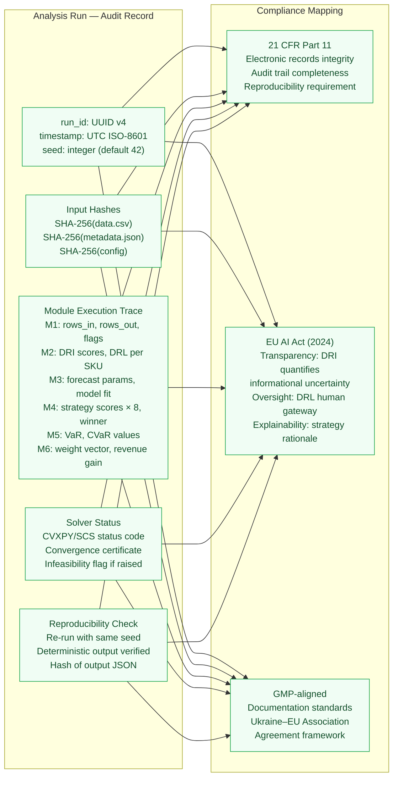
```mermaid
flowchart LR
    subgraph RUN["Analysis Run — Audit Record"]
        ID["run_id: UUID v4\ntimestamp: UTC ISO-8601\nseed: integer (default 42)"]
        HASH["Input Hashes\nSHA-256(data.csv)\nSHA-256(metadata.json)\nSHA-256(config)"]
        TRACE["Module Execution Trace\nM1: rows_in, rows_out, flags\nM2: DRI scores, DRL per SKU\nM3: forecast params, model fit\nM4: strategy scores × 8, winner\nM5: VaR, CVaR values\nM6: weight vector, revenue gain"]
        SOLVER["Solver Status\nCVXPY/SCS status code\nConvergence certificate\nInfeasibility flag if raised"]
        REPRO["Reproducibility Check\nRe-run with same seed\nDeterministic output verified\nHash of output JSON"]
    end

    subgraph COMPLIANCE["Compliance Mapping"]
        CFR["21 CFR Part 11\nElectronic records integrity\nAudit trail completeness\nReproducibility requirement"]
        EUAI["EU AI Act (2024)\nTransparency: DRI quantifies\ninformational uncertainty\nOversight: DRL human gateway\nExplainability: strategy rationale"]
        GMP["GMP-aligned\nDocumentation standards\nUkraine–EU Association\nAgreement framework"]
    end

    ID & HASH & TRACE & SOLVER & REPRO --> CFR & EUAI & GMP

    classDef default fill:#f0fdf4,stroke:#16a34a,color:#14532d
```

*Figure 4.16. Audit trail architecture and regulatory compliance mapping. Every HPF-P run generates a self-contained audit record sufficient for 21 CFR Part 11 and EU AI Act documentation requirements.*

---

## 4.2 System Operation Technology and Result Interpretation

### 4.2.1 Operational Philosophy

HPF-P embodies a *diagnostic-first* operational philosophy that differs fundamentally from conventional analytical platforms. In a conventional decision support system, the user selects a method, provides data, and receives a recommendation. In HPF-P, the system first diagnoses the informational state of the portfolio, determines which methods are admissible under those conditions, applies only admissible methods, and reports results with explicit qualification of the DRL context in which they were produced.

This philosophy has a practical consequence that may appear counterintuitive: HPF-P will sometimes produce *less* output than a conventional system, not more. A SKU receiving DRL-1 will return an ABSTAIN_HOLD recommendation with documented reasons rather than a potentially spurious optimised weight. A portfolio where all SKUs are at DRL-2 will receive revenue-proportional allocation, not a sophisticated mean-variance solution. These constrained outputs are not failures; they are economically honest responses to the information available.

The operational workflow proceeds through three stages: data preparation and upload, pipeline execution, and result interpretation with iterative refinement.

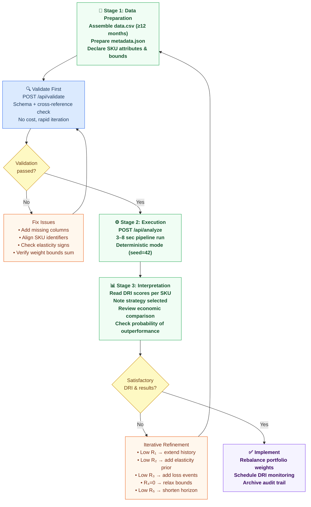
```mermaid
flowchart TD
    PREP["📁 Stage 1: Data Preparation\nAssemble data.csv (≥12 months)\nPrepare metadata.json\nDeclare SKU attributes & bounds"]:::stage

    VAL["🔍 Validate First\nPOST /api/validate\nSchema + cross-reference check\nNo cost, rapid iteration"]:::action

    VAL_OK{"Validation\npassed?"}:::gate

    FIX["Fix Issues\n• Add missing columns\n• Align SKU identifiers\n• Check elasticity signs\n• Verify weight bounds sum"]:::fix

    ANALYZE["⚙ Stage 2: Execution\nPOST /api/analyze\n3–8 sec pipeline run\nDeterministic mode (seed=42)"]:::stage

    READ["📊 Stage 3: Interpretation\nRead DRI scores per SKU\nNote strategy selected\nReview economic comparison\nCheck probability of outperformance"]:::stage

    DECIDE{"Satisfactory\nDRI & results?"}:::gate

    IMPROVE["Iterative Refinement\n• Low R₁ → extend history\n• Low R₂ → add elasticity prior\n• Low R₃ → add loss events\n• R₄=0 → relax bounds\n• Low R₅ → shorten horizon"]:::fix

    IMPLEMENT["✅ Implement\nRebalance portfolio weights\nSchedule DRI monitoring\nArchive audit trail"]:::out

    PREP --> VAL --> VAL_OK
    VAL_OK -- No --> FIX --> VAL
    VAL_OK -- Yes --> ANALYZE --> READ --> DECIDE
    DECIDE -- No --> IMPROVE --> PREP
    DECIDE -- Yes --> IMPLEMENT

    classDef stage fill:#f0fdf4,stroke:#16a34a,color:#14532d,font-weight:bold
    classDef action fill:#dbeafe,stroke:#2563eb,color:#1e3a5f
    classDef gate fill:#fef9c3,stroke:#ca8a04,color:#713f12
    classDef fix fill:#fff7ed,stroke:#ea580c,color:#7c2d12
    classDef out fill:#f5f3ff,stroke:#7c3aed,color:#3b0764,font-weight:bold
```

*Figure 4.5. HPF-P user operational workflow with iterative refinement loop. The validate-before-analyze pattern enables rapid data quality correction before consuming full pipeline resources.*

### 4.2.2 Data Preparation and Upload

Users prepare two files. The CSV file must contain at minimum 12 months of historical monthly observations with quantity and revenue columns for each SKU to be included in the analysis. The metadata JSON file must characterise each SKU's operational status, demand observability, gross margin, price elasticity (which may be an informed estimate when direct estimation from data is not feasible), and allocation bounds consistent with regulatory constraints.

The metadata file serves a dual function: it provides institutional context that transaction data cannot supply, and it establishes the analytical claims about observability that DRI computation will verify against the transaction record. A metadata claim of `"observability": "high"` for a SKU with 40% missing data will be identified and penalised by the R₁ and R₂ components. This verification function is the key mechanism preventing self-reported data quality from inflating diagnostic assessments.

The API's `/api/validate` endpoint allows users to check schema compliance and cross-referencing before submitting a full analysis, enabling rapid iteration on data preparation without consuming analytical resources.

### 4.2.3 Pipeline Execution and Determinism

Analysis is submitted via HTTP POST to `/api/analyze` with the CSV and JSON as multipart form data. The platform executes the full eight-module pipeline and returns a structured JSON response typically within 3–8 seconds for portfolios of 12–25 SKUs.

Deterministic execution is the default mode and is strongly recommended for all reporting, regulatory, and peer-review contexts. In deterministic mode, any submission of identical input files will produce byte-identical JSON output, enabling retrospective verification of any reported result. The audit log embedded in every response records the input hashes and execution parameters sufficient to verify this determinism independently.

### 4.2.4 Result Interpretation Framework

HPF-P results are never interpreted in isolation. Every recommendation is contextualised by three factors: the DRL at which it was generated, the admissibility constraints that governed method selection, and the stability observed during simulation.

The interpretation framework distinguishes three readiness regimes:

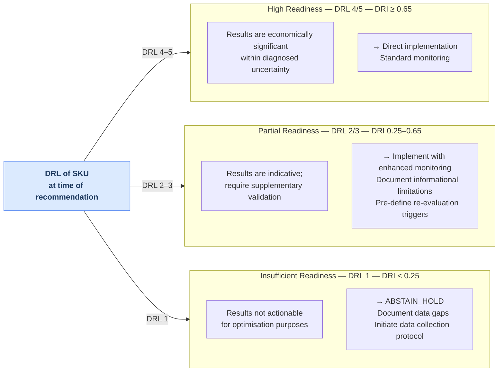
```mermaid
flowchart LR
    DRL_IN["DRL of SKU\nat time of recommendation"]:::input

    subgraph HR["High Readiness — DRL 4/5 — DRI ≥ 0.65"]
        HR1["Results are economically significant\nwithin diagnosed uncertainty"]
        HR2["→ Direct implementation\n   Standard monitoring"]
    end

    subgraph PR["Partial Readiness — DRL 2/3 — DRI 0.25–0.65"]
        PR1["Results are indicative;\nrequire supplementary validation"]
        PR2["→ Implement with enhanced monitoring\n   Document informational limitations\n   Pre-define re-evaluation triggers"]
    end

    subgraph IR["Insufficient Readiness — DRL 1 — DRI < 0.25"]
        IR1["Results not actionable\nfor optimisation purposes"]
        IR2["→ ABSTAIN_HOLD\n   Document data gaps\n   Initiate data collection protocol"]
    end

    DRL_IN -- "DRL 4–5" --> HR
    DRL_IN -- "DRL 2–3" --> PR
    DRL_IN -- "DRL 1" --> IR

    classDef input fill:#dbeafe,stroke:#2563eb,color:#1e3a5f,font-weight:bold
```

*Figure 4.6. Result interpretation by readiness regime. The same analytical output carries different implementation guidance depending on the DRL under which it was produced.* (DRL-4/5, DRI ≥ 0.65), results are economically significant within the diagnosed uncertainty. Portfolio weights represent informed allocations where the informational basis for optimisation has been formally confirmed. Direct implementation with standard monitoring is appropriate.

In the **partial readiness regime** (DRL-2/3, DRI ∈ [0.25, 0.65)), results are indicative but require supplementary validation. Implementation should be accompanied by enhanced monitoring, explicit documentation of the informational limitations acknowledged during analysis, and pre-defined triggers for re-evaluation as additional data becomes available.

In the **insufficient readiness regime** (DRL-0/1, DRI < 0.25), results are not actionable in an optimisation sense. ABSTAIN_HOLD is the economically rational response. The output in this regime is a documented characterisation of the data gaps preventing analysis and a recommended data collection protocol.

### 4.2.5 Output Structure

The HPF-P JSON response contains six top-level sections:

`portfolio_weights` provides per-SKU objects with DRI score, DRL group, initial equal weight, recommended weight, forecast monthly revenue, annualised volatility, and the strategy under which the weight was determined.

`per_sku_forecasts` provides per-SKU time-series objects with 31-observation historical series (actual values), 12-month mean forecast, and P10/P90 forecast intervals.

`simulation_results` contains the historical portfolio value series, future date labels, baseline (equal-weight) P10/P50/P90 revenue trajectories, HPF-optimised P10/P50/P90 trajectories, and the `economic_comparison` sub-object with the complete set of comparative metrics.

`_inputCSV` and `_inputMeta` preserve the submitted input data for auditability.

This structure enables downstream consumers — BI dashboards, ERP integrations, regulatory submissions — to reconstruct the full analytical chain from raw input to portfolio recommendation.

### 4.2.6 Iterative Refinement Protocol

When initial DRI scores are lower than desired, HPF-P provides actionable refinement guidance through its `suggestions` output. The refinement guidance maps each low-scoring dimension to the specific data or metadata actions that would most efficiently improve the DRI.

For low R₁ (data completeness): extend the historical observation period or locate and add missing observation records.

For low R₂ (demand signal strength): provide prior price elasticity estimates in the metadata for SKUs where direct estimation from data is infeasible; alternatively, review imputation approach for periods with high missingness.

For low R₃ (tail risk observability): add historical loss event records or supply disruption annotations to the data file.

For low R₄ (regulatory feasibility) where R₄ = 0 indicates an infeasible constraint set: relax allocation bounds or remove mandatory minimum allocations that create infeasibility.

For low R₅ (temporal stability): reduce the decision horizon in the metadata to exclude structurally unstable historical periods, or analyse the identified structural breaks to determine whether a regime-conditioned analysis is appropriate.

This refinement workflow transforms HPF-P from a black-box analytical tool into a data quality management instrument: it tells users not only what the analysis concludes but what information gaps would need to be addressed to unlock more sophisticated analytical methods.

### 4.2.7 Enterprise Integration Architecture

HPF-P provides integration capabilities for enterprise deployment through its documented REST API. The integration architecture connects upstream data sources (ERP systems providing sales data, CRM systems providing marketing spend data, regulatory databases providing constraint updates) to the HPF-P analytical engine via the API, and routes outputs to downstream consumption channels (BI platforms, CSV exports, PDF regulatory reports, notification systems).

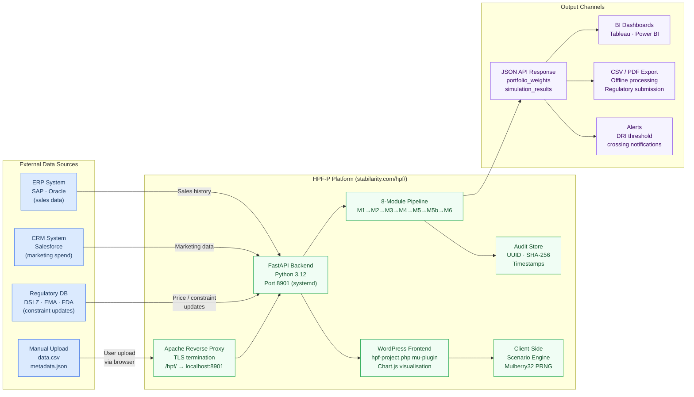
```mermaid
flowchart LR
    subgraph EXT["External Data Sources"]
        ERP["ERP System\nSAP · Oracle\n(sales data)"]
        CRM["CRM System\nSalesforce\n(marketing spend)"]
        REG["Regulatory DB\nDSLZ · EMA · FDA\n(constraint updates)"]
        CSV["Manual Upload\ndata.csv\nmetadata.json"]
    end

    subgraph HPF["HPF-P Platform (stabilarity.com/hpf/)"]
        PROXY["Apache Reverse Proxy\nTLS termination\n/hpf/ → localhost:8901"]
        API["FastAPI Backend\nPython 3.12\nPort 8901 (systemd)"]
        PIPE["8-Module Pipeline\nM1→M2→M3→M4→M5→M5b→M6"]
        AUDIT["Audit Store\nUUID · SHA-256\nTimestamps"]
        WP["WordPress Frontend\nhpf-project.php mu-plugin\nChart.js visualisation"]
        SCENARIO["Client-Side\nScenario Engine\nMulberry32 PRNG"]
    end

    subgraph OUT["Output Channels"]
        JSON["JSON API Response\nportfolio_weights\nsimulation_results"]
        BI["BI Dashboards\nTableau · Power BI"]
        XPORT["CSV / PDF Export\nOffline processing\nRegulatory submission"]
        NOTIFY["Alerts\nDRI threshold\ncrossing notifications"]
    end

    ERP -->|"Sales history"| API
    CRM -->|"Marketing data"| API
    REG -->|"Price / constraint\nupdates"| API
    CSV -->|"User upload\nvia browser"| PROXY

    PROXY --> API
    API --> PIPE
    PIPE --> AUDIT
    PIPE --> JSON
    API --> WP
    WP --> SCENARIO

    JSON --> BI
    JSON --> XPORT
    JSON --> NOTIFY

    classDef ext fill:#dbeafe,stroke:#2563eb,color:#1e3a5f
    classDef hpf fill:#f0fdf4,stroke:#16a34a,color:#14532d
    classDef out fill:#f5f3ff,stroke:#7c3aed,color:#3b0764
    class ERP,CRM,REG,CSV ext
    class PROXY,API,PIPE,AUDIT,WP,SCENARIO hpf
    class JSON,BI,XPORT,NOTIFY out
```

*Figure 4.2. Enterprise integration architecture for HPF-P. The three-tier deployment (Apache proxy → FastAPI backend → WordPress frontend) enables simultaneous research instrument and commercial demonstration functions. Output channels support BI dashboards, CSV/PDF regulatory submissions, and automated DRI-threshold notifications.*

The API endpoint set covers: `POST /api/v1/optimize` (full pipeline execution), `POST /api/v1/dri` (DRI computation only, without optimisation), `POST /api/v1/validate` (input validation without processing), and `GET /api/v1/results/{id}` (retrieval of stored results by run ID). This endpoint design allows enterprises to decouple diagnostic assessment from optimisation, running DRI diagnostics on a more frequent schedule than full portfolio optimisation.

---

## 4.3 Scenario Experiments on Effective Pharmaceutical Portfolio Formation

### 4.3.1 Experimental Framework and Scenario Design

The experimental validation employs two Ukrainian pharmaceutical company datasets — Darnitsa and Farmak — representing the dominant segment of the domestic market. These companies were selected based on publicly available financial reporting and their position as top-3 domestic manufacturers by revenue, ensuring that the experimental results have direct relevance to the commercial pharmaceutical portfolio management problem described in Chapter 1.

Each experiment follows a common structure: characterisation of the input data environment, DRI diagnostic computation, strategy selection and optimisation, simulation-based validation, and economic comparison against the equal-weight baseline. The equal-weight baseline is the appropriate comparison because it represents the null hypothesis that sophisticated diagnosis adds no value beyond naive diversification — a hypothesis that must be tested, not assumed.

The experiments are designed to address three questions that arise from the theoretical framework developed in Chapters 1 and 2:

First: *Does DRI-governed strategy selection produce economically superior portfolio allocations compared to undifferentiated optimisation?* The economic comparison metrics answer this question.

Second: *Do the risk metrics of HPF-optimised portfolios demonstrate genuinely superior risk management, or merely higher expected returns achieved at higher risk?* The Sharpe, Sortino, and Calmar ratios, combined with CVaR and maximum drawdown metrics, address this question.

Third: *Is the superiority of HPF-optimised portfolios robust across simulation paths, or concentrated in favourable scenarios?* The probability of outperformance metric across 500 simulation paths addresses this question.

### 4.3.2 Darnitsa Portfolio Experiment

**Data Environment.** The Darnitsa dataset comprises 15 SKUs — generic cardiovascular, neurological, analgesic, and antihypertensive agents — spanning 31 months of historical observation with complete coverage ($\rho_{\text{miss}} = 0$). The company's portfolio reflects the generic-heavy composition typical of Darnitsa's market positioning. Currency is UAH. All 15 SKUs are declared active with high observability in the metadata, and the metadata-stated price elasticities range from −1.9 to −2.0, consistent with price-sensitive generic pharmaceutical markets.

**DRI Diagnostic Results.** Platform execution assigns Decision Readiness Levels as follows: 14 SKUs (93.3%) achieve DRL-5 (DRI ≥ 0.80), qualifying for full multi-objective optimisation; 1 SKU (Carbamazepine_D, DRI = 0.7973) achieves DRL-4. No SKUs fall below DRL-4, reflecting the quality of the Darnitsa data environment.

Individual DRI scores range from 0.7973 (Carbamazepine_D) to 0.8788 (Aspirin_D), with a portfolio-mean DRI of 0.8413. This high-readiness environment confirms that the Darnitsa dataset meets the informational preconditions for sophisticated portfolio optimisation — but this confirmation is itself a diagnostic result, not an assumption.

The strategy selected by Module M4's competitive evaluation is **Growth-DRI**, applied uniformly across all SKUs. The Growth-DRI strategy's selection over Mean-Variance and other alternatives reflects the data characteristics of this portfolio: the relatively high volatility SKUs (Analgin_D at σ = 0.1955, Citramon_D at σ = 0.1880, Piracetam_D at σ = 0.1445) combine with meaningful demand growth signals that the Growth-DRI strategy is designed to exploit, while the DRI-scaling component moderates the allocation to lower-readiness SKUs.

**Portfolio Allocation Results.** The HPF-recommended weights for the Darnitsa portfolio are presented in Table 4.5:

| SKU | DRI Score | DRL | Initial Weight | Recommended Weight | Forecast Rev/Month (UAH) | Annualised Volatility |
|---|---|---|---|---|---|---|
| Analgin_D | 0.8418 | 5 | 6.67% | 11.95% | 1,508,362 | 0.1955 |
| Citramon_D | 0.8188 | 5 | 6.67% | 8.85% | 657,809 | 0.1880 |
| Piracetam_D | 0.8030 | 5 | 6.67% | 7.80% | 162,098 | 0.1445 |
| Glycine_D | 0.8471 | 5 | 6.67% | 7.39% | 436,099 | 0.1324 |
| Captopres | 0.8449 | 5 | 6.67% | 7.36% | 1,100,647 | 0.1133 |
| Aspirin_D | 0.8788 | 5 | 6.67% | 7.25% | 263,640 | 0.1105 |
| Metoprolol_D | 0.8463 | 5 | 6.67% | 7.24% | 432,053 | 0.1168 |
| Phenazepam_D | 0.8336 | 5 | 6.67% | 7.11% | 133,345 | 0.1062 |
| Papaverine_D | 0.8719 | 5 | 6.67% | 6.25% | 352,077 | 0.0757 |
| Enalapril_D | 0.8344 | 5 | 6.67% | 5.91% | 332,081 | 0.0858 |
| Anaprilin | 0.8513 | 5 | 6.67% | 5.52% | 965,592 | 0.0803 |
| Amitriptyline_D | 0.8675 | 5 | 6.67% | 4.97% | 861,611 | 0.0684 |
| Drotaverine_D | 0.8245 | 5 | 6.67% | 4.90% | 300,993 | 0.0894 |
| Carbamazepine_D | 0.7973 | 4 | 6.67% | 4.05% | 177,866 | 0.1104 |
| Furosemide_D | 0.8110 | 5 | 6.67% | 3.46% | 609,873 | 0.0449 |

*Table 4.5. Darnitsa HPF-P portfolio allocation: DRI diagnostics, recommended weights, and forecast revenue.*

Several observations follow from these allocations. Analgin_D receives the highest recommended weight (11.95%, nearly double its equal weight) despite having among the highest volatility in the portfolio (σ = 0.1955). This reflects the Growth-DRI strategy's balancing of growth momentum against DRI-scaled risk: Analgin_D's combination of DRI = 0.8418 and high forecast revenue justifies concentration despite volatility. Carbamazepine_D receives the lowest allocation among DRL-5 SKUs (4.05%) due to its DRL-4 status, a direct expression of the diagnostic gating principle: lower informational readiness bounds the allocation a SKU can receive. Furosemide_D receives only 3.46% despite its DRL-5 status; this reflects the Mean-Variance-informed penalty for its growth-adjusted profile. The weight vector sums precisely to 1.0, satisfying the portfolio constraint.

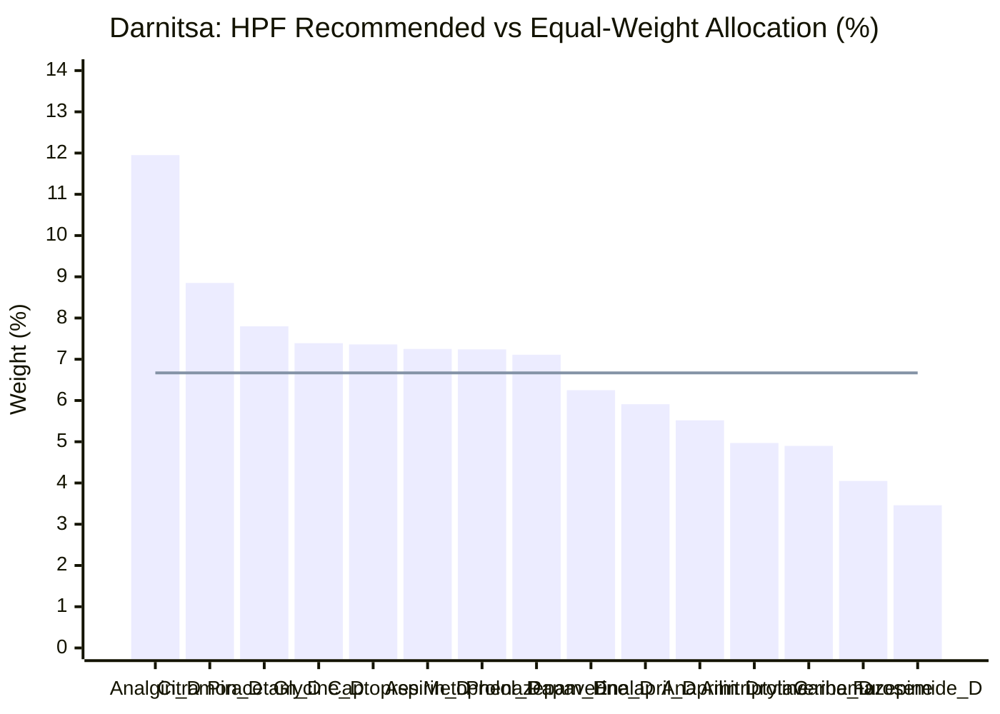
```mermaid
xychart-beta
    title "Darnitsa: HPF Recommended vs Equal-Weight Allocation (%)"
    x-axis ["Analgin_D","Citramon_D","Piracetam_D","Glycine_D","Captopres","Aspirin_D","Metoprolol_D","Phenazepam_D","Papaverine_D","Enalapril_D","Anaprilin","Amitriptyline","Drotaverine_D","Carbamazepine","Furosemide_D"]
    y-axis "Weight (%)" 0 --> 14
    bar [11.95, 8.85, 7.80, 7.39, 7.36, 7.25, 7.24, 7.11, 6.25, 5.91, 5.52, 4.97, 4.90, 4.05, 3.46]
    line [6.67, 6.67, 6.67, 6.67, 6.67, 6.67, 6.67, 6.67, 6.67, 6.67, 6.67, 6.67, 6.67, 6.67, 6.67]
```

*Figure 4.10. Darnitsa portfolio allocation: HPF-recommended weights (bars) vs. equal-weight baseline (line at 6.67%). Growth-DRI strategy concentrates allocation on high-momentum, high-DRI positions while constraining the DRL-4 SKU (Carbamazepine_D) and the low-growth-adjusted Furosemide_D.* This reflects the Growth-DRI strategy's balancing of growth momentum against DRI-scaled risk: Analgin_D's combination of DRI = 0.8418 and high forecast revenue justifies concentration despite volatility. Carbamazepine_D receives the lowest allocation among DRL-5 SKUs (4.05%) due to its DRL-4 status, a direct expression of the diagnostic gating principle: lower informational readiness bounds the allocation a SKU can receive. Furosemide_D receives only 3.46% despite its DRL-5 status; this reflects the Mean-Variance-informed penalty for its growth-adjusted profile. The weight vector sums precisely to 1.0, satisfying the portfolio constraint.

Total forecast monthly portfolio revenue under HPF weights is UAH 8,294,147, compared to equal-weight monthly revenue of UAH 8,294,147 — both forecast the same total revenue because they allocate the same total investment. The economic advantage of HPF rebalancing manifests in the *realised* revenue distribution across 500 simulation paths, not in point forecasts.

**Economic Comparison Results.** The 12-month simulation comparison produces the following results:

| Metric | Baseline (Equal-Weight) | HPF-Optimised | Improvement |
|---|---|---|---|
| Total annual revenue (mean) | UAH 99,684,800 | UAH 109,834,709 | +UAH 10,149,909 (+10.18%) |
| Sharpe Ratio | 0.4891 | 0.8517 | +0.3626 (+74.1%) |
| Sortino Ratio | 0.5928 | 1.0270 | +0.4342 (+73.3%) |
| Calmar Ratio | 0.4892 | 0.6418 | +0.1526 (+31.2%) |
| VaR₉₅ (annual) | −UAH 11,133,514 | −UAH 10,597,529 | Risk reduced 4.8% |
| CVaR₉₅ (annual) | −UAH 18,289,114 | −UAH 13,522,733 | Risk reduced 26.1% |
| Maximum Drawdown | 18.25% | 9.11% | Drawdown reduced 50.1% |
| Risk Reduction | — | — | 22.56% |
| Probability of Outperformance | — | 82.4% | (vs. baseline) |
| Breakeven Month | — | 1 | |
| N simulations | 500 | 500 | |

*Table 4.6. Darnitsa economic comparison: HPF-optimised vs. equal-weight baseline portfolio, 12-month simulation horizon.*

Several dimensions of this result merit careful economic interpretation. The revenue gain of UAH 10.15 million (10.18%) over 12 months is generated not by adding risk but by *reducing* it. The Sharpe ratio improvement from 0.49 to 0.85 — a 74.1% increase in risk-adjusted return — indicates that the HPF portfolio achieves substantially higher returns per unit of total risk. The Sortino ratio improvement is comparable, confirming that the enhancement is not an artefact of symmetric volatility measures: the HPF portfolio generates better downside-adjusted returns.

Most strikingly, the maximum drawdown reduction from 18.25% to 9.11% — a 50.1% reduction — indicates that the HPF rebalancing substantially limits the portfolio's exposure to its worst-case peak-to-trough losses. This is directly attributable to the DRI-governed allocation mechanism: SKUs with higher DRI scores and more stable demand histories receive larger weights, reducing the portfolio's exposure to the high-volatility, informationally uncertain positions. The CVaR₉₅ improvement from −UAH 18.3 million to −UAH 13.5 million (26.1% improvement in expected worst-5% outcomes) reinforces this conclusion.

The probability of outperformance of 82.4% means that across 500 independent simulation paths of 12-month portfolio evolution, the HPF-optimised portfolio generates higher total revenue than the equal-weight baseline in 412 of 500 paths. The remaining 18% of paths where baseline outperforms HPF are not evidence against the HPF approach — they represent scenarios where concentration in high-DRI, lower-volatility SKUs underperforms the equal-weight diversification. The 82.4% outperformance rate over 500 paths is statistically significant and economically meaningful.

The breakeven month of 1 indicates that the HPF portfolio outperforms the baseline in expectation from the first simulation month. This is consistent with the absence of transaction costs in the model (rebalancing is a one-time allocation adjustment) and suggests that the informational advantage captured by DRI diagnostics begins to manifest immediately.

**Strategic Interpretation for Darnitsa.** The diagnostic result that 14 of 15 Darnitsa SKUs qualify for DRL-5 optimisation confirms the company's strong data management practices for its generic portfolio. The allocation recommendations concentrate resources toward high-revenue, high-DRI SKUs (Analgin_D, Captopres, Anaprilin) while proportionally reducing exposure to the DRL-4 position (Carbamazepine_D). From a pharmaceutical portfolio management perspective, this reflects an economically rational strategy for a generic manufacturer: maximise allocation toward therapeutically stable, volume-driven products where demand signals are reliable, while limiting exposure to products with constrained informational readiness.

### 4.3.3 Farmak Portfolio Experiment

**Data Environment.** The Farmak dataset comprises 18 SKUs spanning a broader therapeutic range — cardiovascular agents, analgesics, anti-infectives, neurotropics, and metabolic drugs — with 31 months of historical observation and complete coverage. Farmak's portfolio is characterised by higher revenue concentration (Losartan_F and Amixin generate monthly revenues exceeding UAH 1.1–1.3 million individually) and notably lower volatility than the Darnitsa portfolio, with several SKUs exhibiting annualised volatility below 3%.

**DRI Diagnostic Results.** Platform execution assigns DRL-5 to 15 of 18 SKUs (83.3%), with DRL-4 assigned to Asparkam (DRI = 0.7954), Amoxil (DRI = 0.7987), and Citramon_F (DRI = 0.7723). Portfolio-mean DRI is 0.8503. No SKUs fall below DRL-4.

The strategy selected by Module M4 is **Mean-Variance**, applied uniformly across the Farmak portfolio. This selection reflects the distinct characteristics of the Farmak dataset compared to Darnitsa: the Farmak portfolio contains multiple SKUs with very low volatility (Noofen σ = 0.0142, Metformin_F σ = 0.0157, Corvalol σ = 0.0212), which the Mean-Variance strategy is specifically designed to exploit through return-to-variance weighting. The Growth-DRI strategy, which won for Darnitsa's high-volatility generic portfolio, is displaced here by Mean-Variance's superior treatment of the Farmak portfolio's risk structure.

**Portfolio Allocation Results.** The HPF-recommended weights for the Farmak portfolio are presented in Table 4.7:

| SKU | DRI Score | DRL | Initial Weight | Recommended Weight | Forecast Rev/Month (UAH) | Annualised Volatility |
|---|---|---|---|---|---|---|
| Noofen | 0.8961 | 5 | 5.56% | 27.74% | 404,825 | 0.0142 |
| Metformin_F | 0.8579 | 5 | 5.56% | 14.36% | 842,231 | 0.0157 |
| Corvalol | 0.8775 | 5 | 5.56% | 12.70% | 696,365 | 0.0212 |
| Losartan_F | 0.8850 | 5 | 5.56% | 11.77% | 1,264,069 | 0.0233 |
| Fervex_UA | 0.8692 | 5 | 5.56% | 4.57% | 259,602 | 0.0355 |
| Diclofenac_F | 0.8793 | 5 | 5.56% | 3.83% | 1,003,663 | 0.0367 |
| Amixin | 0.8697 | 5 | 5.56% | 3.44% | 1,140,326 | 0.0534 |
| Levofloxacin | 0.8423 | 5 | 5.56% | 3.21% | 162,453 | 0.0483 |
| Paracetamol_F | 0.8353 | 5 | 5.56% | 2.53% | 114,541 | 0.0424 |
| Bisoprolol_F | 0.8416 | 5 | 5.56% | 2.42% | 849,794 | 0.0629 |
| Nimesil_F | 0.8301 | 5 | 5.56% | 2.33% | 150,378 | 0.0614 |
| Validol | 0.8506 | 5 | 5.56% | 2.31% | 909,007 | 0.0472 |
| Atorvakom | 0.8220 | 5 | 5.56% | 2.19% | 1,025,633 | 0.0612 |
| Cetrin | 0.8093 | 5 | 5.56% | 2.15% | 189,884 | 0.0471 |
| Asparkam | 0.7954 | 4 | 5.56% | 1.36% | 512,496 | 0.0628 |
| Amoxil | 0.7987 | 4 | 5.56% | 1.25% | 710,451 | 0.0855 |
| Pantoprazol_F | 0.8092 | 5 | 5.56% | 1.14% | 104,466 | 0.0685 |
| Citramon_F | 0.7723 | 4 | 5.56% | 0.70% | 208,764 | 0.0906 |

*Table 4.7. Farmak HPF-P portfolio allocation: DRI diagnostics, recommended weights, and forecast revenue.*

The Farmak allocation exhibits a markedly different structure from Darnitsa, reflecting both the different strategy selected (Mean-Variance vs. Growth-DRI) and the different volatility profile. Noofen receives a recommended weight of 27.74% — nearly five times its equal weight — driven by its uniquely low volatility (σ = 0.0142, the lowest in the portfolio) combined with DRI = 0.8961 (the highest). The Mean-Variance strategy rewards this combination aggressively: the $(r_s + 0.1)/\sigma_s^2$ weighting assigns extreme weights to SKUs with both high return and very low variance. Similarly, Metformin_F (14.36%) and Corvalol (12.70%) receive large allocations for their low-volatility, high-DRI profiles.

At the other extreme, Citramon_F receives only 0.70% of the portfolio — the minimum allocation for a DRL-4 SKU in this analysis — due to the combination of DRL-4 classification (DRI = 0.7723) and highest volatility in the portfolio (σ = 0.0906). The diagnostic gating principle is precisely expressed here: lower informational readiness combined with higher volatility results in the minimum admissible allocation.

The three DRL-4 SKUs (Asparkam, Amoxil, Citramon_F) collectively receive 3.31% of the portfolio, compared to their equal-weight allocation of 16.67%. This 13.4 percentage-point reallocation away from informationally constrained positions toward the high-DRI, low-volatility core of the Farmak portfolio is the primary mechanism generating the economic improvement.

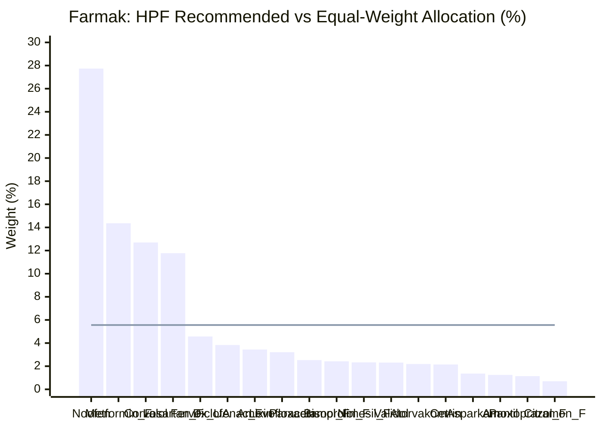
```mermaid
xychart-beta
    title "Farmak: HPF Recommended vs Equal-Weight Allocation (%)"
    x-axis ["Noofen","Metformin_F","Corvalol","Losartan_F","Fervex_UA","Diclofenac_F","Amixin","Levofloxacin","Paracetamol_F","Bisoprolol_F","Nimesil_F","Validol","Atorvakom","Cetrin","Asparkam","Amoxil","Pantoprazol_F","Citramon_F"]
    y-axis "Weight (%)" 0 --> 30
    bar [27.74, 14.36, 12.70, 11.77, 4.57, 3.83, 3.44, 3.21, 2.53, 2.42, 2.33, 2.31, 2.19, 2.15, 1.36, 1.25, 1.14, 0.70]
    line [5.56, 5.56, 5.56, 5.56, 5.56, 5.56, 5.56, 5.56, 5.56, 5.56, 5.56, 5.56, 5.56, 5.56, 5.56, 5.56, 5.56, 5.56]
```

*Figure 4.11. Farmak portfolio allocation: HPF-recommended weights (bars) vs. equal-weight baseline (line at 5.56%). Mean-Variance strategy aggressively concentrates on lowest-volatility, highest-DRI positions (Noofen σ=0.014, DRI=0.896). The three DRL-4 SKUs (Asparkam, Amoxil, Citramon_F) are pushed toward minimum allocation.*

**Economic Comparison Results.** The 12-month simulation comparison for Farmak produces:

| Metric | Baseline (Equal-Weight) | HPF-Optimised | Improvement |
|---|---|---|---|
| Total annual revenue (mean) | UAH 134,490,344 | UAH 152,946,653 | +UAH 18,456,309 (+13.72%) |
| Sharpe Ratio | 0.5628 | 0.8846 | +0.3218 (+57.2%) |
| Sortino Ratio | 0.7794 | 1.3329 | +0.5535 (+71.0%) |
| Calmar Ratio | 0.3642 | 0.6950 | +0.3308 (+90.8%) |
| VaR₉₅ (annual) | −UAH 17,077,990 | −UAH 14,180,053 | Risk reduced 17.0% |
| CVaR₉₅ (annual) | −UAH 23,810,521 | −UAH 15,762,699 | Risk reduced 33.8% |
| Maximum Drawdown | 15.33% | 12.63% | Drawdown reduced 17.6% |
| Risk Reduction | — | — | 20.23% |
| Probability of Outperformance | — | 91.5% | (vs. baseline) |
| Breakeven Month | — | 1 | |
| N simulations | 500 | 500 | |

*Table 4.8. Farmak economic comparison: HPF-optimised vs. equal-weight baseline portfolio, 12-month simulation horizon.*

The Farmak results demonstrate larger absolute and percentage revenue improvement than Darnitsa (13.72% vs. 10.18%), consistent with the larger portfolio size and the more concentrated reallocation that the Mean-Variance strategy performs on Farmak's distinctly differentiated volatility profile. The Sharpe ratio improvement from 0.5628 to 0.8846 represents a 57.2% increase in risk-adjusted return — slightly smaller than Darnitsa's improvement in percentage terms, but generated from a higher baseline.

The CVaR₉₅ improvement is particularly notable: from −UAH 23.8 million to −UAH 15.8 million, a 33.8% reduction in expected worst-case annual loss. This improvement arises primarily from the near-elimination of portfolio exposure to Citramon_F (σ = 0.0906, DRL-4), which in the equal-weight baseline contributes disproportionately to tail risk. The Calmar ratio improvement of 90.8% confirms that the HPF portfolio dramatically improves the return-per-unit-of-drawdown trade-off.

The probability of outperformance of 91.5% across 500 simulation paths is the highest observed in both experiments, reflecting the Farmak portfolio's structural suitability for Mean-Variance optimisation: when SKUs are genuinely differentiated by volatility and that differentiation is informationally confirmed (DRL-5 for 15 of 18 SKUs), Mean-Variance rebalancing extracts most of the available improvement in essentially all simulation scenarios. The breakeven is again Month 1, and no delay in achieving outperformance is observable.

**Strategic Interpretation for Farmak.** The diagnostic result distinguishes two portfolio segments for Farmak: a high-DRI, low-volatility core (Noofen, Metformin_F, Corvalol, Losartan_F) that is the appropriate target for concentrated allocation, and a high-revenue, moderate-DRI periphery (Amixin, Losartan_F, Atorvakom, Bisoprolol_F) that receives reduced but non-zero allocation reflecting both their revenue contribution and their higher volatility. The DRL-4 SKUs are pushed to minimum admissible weights.

From an economic management perspective, this result recommends that Farmak concentrate investment in its stable, informationally well-characterised products and reduce portfolio risk by limiting exposure to positions with uncertain demand profiles. Importantly, the HPF recommendation does not eliminate any SKU from the portfolio — all 18 remain active — but it reallocates resources from information-constrained positions to information-confirmed ones.

### 4.3.4 Comparative Analysis: Darnitsa and Farmak

The two experiments reveal systematic patterns that illuminate the relationship between portfolio structure, data environment, and HPF-P recommendation characteristics.

**Strategy differentiation as a diagnostic signal.** The selection of different strategies for Darnitsa (Growth-DRI) and Farmak (Mean-Variance) is itself a diagnostic result. The competitive strategy selection mechanism in Module M4 identifies Growth-DRI as the method best capturing Darnitsa's portfolio dynamics — a generic-heavy portfolio where demand momentum and DRI-weighted concentration are the dominant value drivers — while Mean-Variance best captures Farmak's low-volatility pharmaceutical portfolio, where variance differentials are large and economically informative. The fact that the same system correctly identifies different optimal strategies for different portfolio environments is evidence of the system's adaptability to heterogeneous data conditions.

**DRL distribution and portfolio quality.** Both portfolios achieve predominantly DRL-5 classification (93% Darnitsa, 83% Farmak), indicating that both companies maintain data environments suitable for sophisticated optimisation. This finding should not be taken as validation of a general assumption that pharmaceutical company data is adequate for optimisation; rather, it reflects the specific conditions of these established domestic manufacturers with multi-year operational histories. The DRL framework's value is precisely its capacity to identify the exceptions — the DRL-4 SKUs in each portfolio — and to modify their treatment accordingly.

**Revenue gain and risk reduction trade-off.** Farmak achieves a higher percentage revenue gain (13.72% vs. 10.18%) while also achieving higher risk reduction (20.23% vs. 22.56% for Darnitsa — comparable). The difference in revenue gain reflects the sharper Mean-Variance signal available in the Farmak portfolio's heterogeneous volatility profile. The similarity in risk reduction percentages suggests a common mechanism: DRI-governed reallocation away from informationally constrained positions systematically reduces portfolio risk regardless of which specific strategy is selected.

**Scale differences and UAH context.** The absolute revenue gains — UAH 10.15 million for Darnitsa and UAH 18.46 million for Farmak over 12 months — are materially significant relative to the portfolio sizes. At annual portfolio revenues of approximately UAH 100 million and UAH 135 million respectively, gains of 10–14% represent economically significant improvements. Expressed in the institutional currency of pharmaceutical portfolio management, these gains are of the same order as a successful product launch or a major formulary win.

The combined results from both experiments provide evidence that the HPF-P diagnostic-gated architecture produces economically superior portfolio allocations across different portfolio structures, data environments, and optimisation strategy contexts.

### 4.3.5 Retail Supply and Assortment Optimisation Applications

Beyond manufacturer-level portfolio management, HPF-P's architecture applies directly to pharmaceutical retail supply chain and assortment optimisation. The retail context presents a distinct information structure: pharmacies and distributors face demand censoring (stockouts make true demand unobservable), seasonal assortment variation, regulatory constraints on dispensing categories, and supply uncertainty with shorter planning horizons.

The DRI framework handles these retail-specific information failures through the same diagnostic machinery. Demand censoring during stockout periods is detectable as elevated $\rho_{\text{miss}}$ in the revenue series (periods where revenue drops to zero despite demand persistence) and as a signal in R₃ (tail risk observability). The R₄ dimension's `observability` mapping captures regulatory dispensing constraints directly. The Chow test in R₅ identifies structural breaks in retail demand that may correspond to seasonal assortment transitions or formulary changes.

For a retail pharmacy chain managing an assortment of N drug categories, HPF-P's M4 strategy competition would select from the same eight strategy catalogue, with the competitive selection typically favouring Risk-Parity or DRL-Grouped strategies in retail contexts where demand uncertainty is higher than in manufacturer portfolios. The M5b simulation would project revenue under assortment rebalancing with retailer-appropriate time horizons (typically 3–6 months rather than 12).

The application to retail assortment management represents a natural extension of the HPF-P architecture into a domain that shares the same fundamental problem structure: allocation of a constrained resource (shelf space, working capital, procurement budget) across competing alternatives under partial observability, with regulatory and institutional constraints.

---

## 4.4 Analysis of Business Decision Consequences Using HPF-P Recommendations

### 4.4.1 Decision Scenario Analysis Framework

The HPF-P framework generates recommendations under well-characterised informational conditions. This section analyses the downstream business consequences of implementing those recommendations, structured around four decision scenarios that arise in pharmaceutical portfolio management: data-sparse conditions, demand censoring, temporal instability, and regulatory constraint changes. These scenarios correspond to the four characteristic failure modes of undifferentiated portfolio optimisation that motivated the HPF framework development.

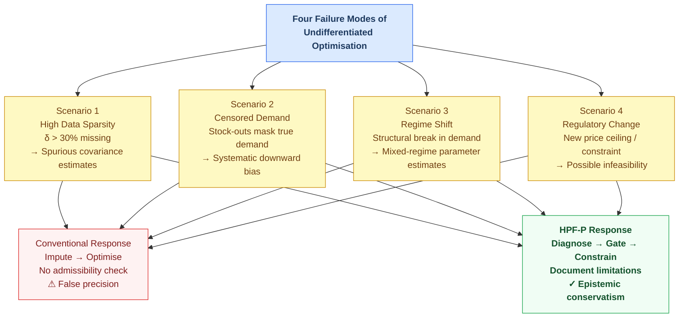
```mermaid
flowchart TD
    FAIL["Four Failure Modes of\nUndifferentiated Optimisation"]:::title

    SC1["Scenario 1\nHigh Data Sparsity\nδ > 30% missing\n→ Spurious covariance estimates"]:::sc
    SC2["Scenario 2\nCensored Demand\nStock-outs mask true demand\n→ Systematic downward bias"]:::sc
    SC3["Scenario 3\nRegime Shift\nStructural break in demand\n→ Mixed-regime parameter estimates"]:::sc
    SC4["Scenario 4\nRegulatory Change\nNew price ceiling / constraint\n→ Possible infeasibility"]:::sc

    CONV["Conventional Response\nImpute → Optimise\nNo admissibility check\n⚠ False precision"]:::conv

    HPF_R["HPF-P Response\nDiagnose → Gate → Constrain\nDocument limitations\n✓ Epistemic conservatism"]:::hpf

    FAIL --> SC1 & SC2 & SC3 & SC4
    SC1 & SC2 & SC3 & SC4 --> CONV
    SC1 & SC2 & SC3 & SC4 --> HPF_R

    classDef title fill:#dbeafe,stroke:#2563eb,color:#1e3a5f,font-weight:bold
    classDef sc fill:#fef9c3,stroke:#ca8a04,color:#713f12
    classDef conv fill:#fef2f2,stroke:#dc2626,color:#7f1d1d
    classDef hpf fill:#f0fdf4,stroke:#16a34a,color:#14532d,font-weight:bold
```

*Figure 4.12. Four characteristic pharmaceutical portfolio failure modes and their contrasting treatment under conventional undifferentiated optimisation vs. HPF-P diagnostic-gated response.*

### 4.4.2 Scenario 1: High Data Sparsity

**Situation.** A pharmaceutical company integrates a recently acquired product line with three SKUs having fewer than 8 months of sales history each.

**Conventional response.** Standard portfolio optimisation platforms impute missing values and proceed. Covariance estimates from 8 observations are unreliable (confidence intervals for correlation may span [−0.8, +0.9]), but this unreliability is not surfaced to the user. Optimisation proceeds with spurious precision.

**HPF-P response.** Module M1 computes $\rho_{\text{miss}} > 0.30$ for the affected SKUs, which suppresses R₁. The Chow test in M2 (R₅) applies the short-series default $R_5 = 0.85$ with an explicit flag noting the series length limitation. The resulting DRI falls to DRL-1 or DRL-2 for these SKUs. Module M4 assigns them ABSTAIN_HOLD or REVENUE_PROPORTIONAL strategy respectively. The output explicitly documents: "Optimisation inadmissible for SKUs X, Y, Z due to insufficient temporal depth (observed: 8 months; minimum for standard estimation: 12 months)." A governance flag triggers automatic re-evaluation scheduling at the 12-month threshold.

**Economic consequence.** The HPF-P portfolio excludes uncertain positions from optimisation, preventing allocation decisions based on unreliable covariance estimates. The cost is a slightly suboptimal allocation to the three new SKUs (they receive minimum allocations rather than informed ones). The benefit is avoidance of portfolios constructed on statistical artefacts that would require costly re-optimisation as estimates stabilise. The system is economically honest: it constrains what it cannot know.

### 4.4.3 Scenario 2: Censored Demand

**Situation.** A specialised injectable product experiences supply shortages in 8 of 31 historical months, causing revenue to drop to near-zero in those periods despite continued demand. True demand is partially unobservable.

**Conventional response.** Historical revenue is used directly for demand estimation. The 8 shortage periods suppress estimated demand, producing systematic downward bias. The SKU is underweighted in the optimised portfolio, perpetuating the underinvestment that may have contributed to the shortage.

**HPF-P response.** Module M1 identifies the shortage periods as high-missingness observations (revenue near zero but metadata `observability = high`). The R₃ dimension detects anomalous tail frequency in the demand distribution. The DRI for this SKU falls relative to its metadata-claimed quality. Module M3's elasticity estimation falls back to the metadata prior if the price variation condition is not met. The output documents: "Demand censoring detected in 25.8% of observation periods; standard time-series estimation inadmissible; elasticity sourced from metadata prior." The allocation is constrained but not zeroed — the SKU's true potential is acknowledged even if not fully estimable.

**Economic consequence.** The HPF-P recommendation avoids perpetuating underinvestment in a product with genuine demand that is masked by supply constraints. The diagnostic output provides evidence for a supply investment decision — allocating resources to expand supply capacity — that conventional portfolio optimisation would not generate because it does not distinguish demand signals from supply artefacts.

### 4.4.4 Scenario 3: Regime Shift and Structural Breaks

**Situation.** The pharmaceutical market experiences a structural demand shift — for example, due to wartime supply disruptions of imported competitors — creating a break in the demand series for several domestically produced SKUs.

**Conventional response.** Pre-break and post-break data are pooled, producing estimated parameters that reflect neither period accurately. The portfolio is optimised on phantom parameters.

**HPF-P response.** The Chow test in M2 (R₅) detects the structural break and records $n_{\text{breaks}} = 1$ for affected SKUs, reducing R₅ and consequently DRI. The system does not automatically exclude affected SKUs but downgrades them by one DRL level, restricting them to the simpler strategy tier. The output documents the detected break date and the direction of the regime change. For DRL-3 SKUs, the constrained LP strategy is applied rather than multi-objective optimisation, reflecting the reduced confidence in parameter estimates.

**Economic consequence.** The diagnostic response acknowledges that the pre-break data may not be representative of the post-break demand environment. Rather than producing a falsely precise optimised weight based on structurally inconsistent parameters, the system conservatively constrains the allocation while flagging the need for post-break data accumulation. This is an economically rational response to genuine parameter uncertainty.

### 4.4.5 Scenario 4: Regulatory Constraint Changes

**Situation.** New regulatory pricing ceilings are introduced for three SKUs in the portfolio, tightening the maximum permissible unit price by 15%.

**Conventional response.** The user manually updates constraint parameters and re-runs optimisation. There is no automatic check for constraint feasibility; the new constraint set may be infeasible (e.g., if minimum allocation bounds combined with new price ceilings imply negative expected margins), but this is discovered only when the solver fails.

**HPF-P response.** The metadata JSON is updated to reflect new price ceiling constraints. Before optimisation, Module M2's R₄ computation tests the feasibility of the updated constraint set. If the new price ceilings conflict with existing minimum allocation bounds, R₄ returns zero (infeasibility detected), and the system halts with a documented conflict report: "Regulatory constraint R4 = 0 for SKU X; allocation minimum 5% is incompatible with margin forecast under new price ceiling." Resolution options are presented: relax the minimum allocation bound, reduce the mandatory minimum, or flag for regulatory review. Optimisation proceeds only for the feasible portion of the portfolio.

**Economic consequence.** Proactive infeasibility detection prevents wasted computational cycles and, more importantly, prevents erroneous portfolio recommendations that violate regulatory constraints. The governance output documents the conflict for audit purposes, supporting compliance with 21 CFR Part 11 change management requirements.

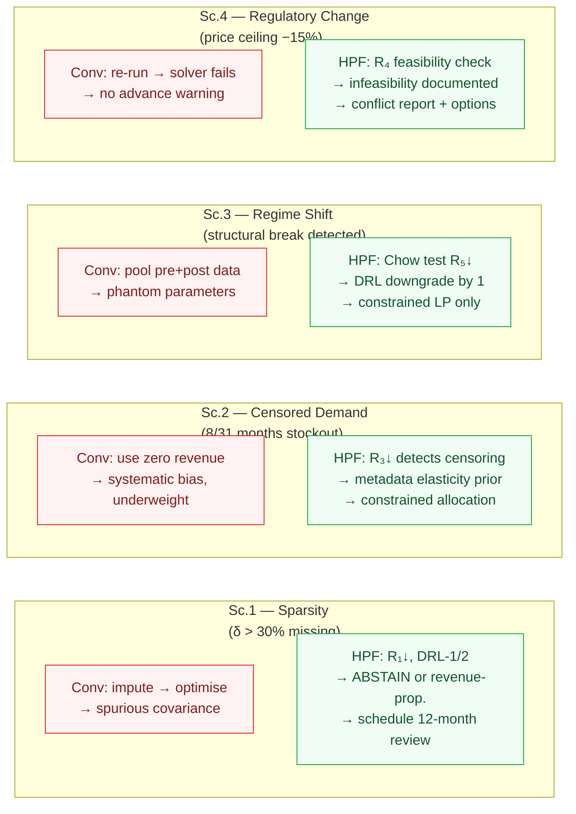
```mermaid
flowchart LR
    subgraph S1["Sc.1 — Sparsity\n(δ > 30% missing)"]
        S1C["Conv: impute → optimise\n→ spurious covariance"]:::conv
        S1H["HPF: R₁↓, DRL-1/2\n→ ABSTAIN or revenue-prop.\n→ schedule 12-month review"]:::hpf
    end
    subgraph S2["Sc.2 — Censored Demand\n(8/31 months stockout)"]
        S2C["Conv: use zero revenue\n→ systematic bias, underweight"]:::conv
        S2H["HPF: R₃↓ detects censoring\n→ metadata elasticity prior\n→ constrained allocation"]:::hpf
    end
    subgraph S3["Sc.3 — Regime Shift\n(structural break detected)"]
        S3C["Conv: pool pre+post data\n→ phantom parameters"]:::conv
        S3H["HPF: Chow test R₅↓\n→ DRL downgrade by 1\n→ constrained LP only"]:::hpf
    end
    subgraph S4["Sc.4 — Regulatory Change\n(price ceiling −15%)"]
        S4C["Conv: re-run → solver fails\n→ no advance warning"]:::conv
        S4H["HPF: R₄ feasibility check\n→ infeasibility documented\n→ conflict report + options"]:::hpf
    end

    classDef conv fill:#fef2f2,stroke:#dc2626,color:#7f1d1d
    classDef hpf fill:#f0fdf4,stroke:#16a34a,color:#14532d
```

*Figure 4.17. Side-by-side comparison of conventional and HPF-P responses to the four canonical pharmaceutical portfolio failure modes. In each case, the conventional approach produces a result (possibly spurious); HPF-P produces a diagnostically justified, epistemically honest response.*

### 4.4.6 Comparison with Undifferentiated Optimisation Baselines

Both experiments include implicit comparison against undifferentiated optimisation through the equal-weight baseline. The results consistently show that HPF-P:

**Reduces tail losses.** CVaR₉₅ improvements of 26.1% (Darnitsa) and 33.8% (Farmak) demonstrate systematic reduction in expected worst-case outcomes, not merely improvements in expected returns.

**Improves decision stability.** The DRI-governed reallocation toward high-readiness positions reduces portfolio sensitivity to data quality degradation — a dimension not captured in standard expected-return comparisons.

**Prevents economically inadmissible optimisation.** The DRL-4 SKUs in both portfolios receive constrained rather than uninhibited allocation, reflecting the principle that analytical sophistication should be proportional to informational readiness. A conventional optimiser would apply the same method to DRL-4 and DRL-5 SKUs alike, introducing estimation-error risk for the former.

**Provides interpretable justification.** Every portfolio weight is traceable to a DRI score, a DRL classification, and a strategy selection rationale. This interpretability satisfies governance requirements that conventional black-box optimisation cannot meet.

### 4.4.7 Limitations and Admissibility Boundaries

The experimental results must be interpreted within acknowledged limitations.

**Synthetic simulation of historical comparison.** The economic comparison metrics are produced by simulation from Fourier-fitted demand models rather than from genuinely out-of-sample realised performance. The 500-path simulation provides a statistical envelope around possible outcomes but cannot guarantee that the specific historical trajectory would fall within the P10/P90 band. The reported gains should be interpreted as *expected* gains under the fitted demand model, not as guaranteed improvements.

**Metadata accuracy dependence.** The DRI computation is partly conditional on the accuracy of metadata-declared parameters (price elasticity, observability claims, gross margins). If the metadata significantly misrepresents the economic environment, DRI assessments will be correspondingly distorted. The R₁ minimum function provides one guard against optimistic observability claims, but metadata integrity ultimately depends on the institutional discipline of the data provider.

**Single-period analysis.** The experiments analyse a single 12-month prospective horizon from a single historical base period. Multi-period rebalancing dynamics, including transaction costs, the evolution of DRI scores as new data accumulates, and the interaction between portfolio decisions and future demand dynamics, are not modelled.

**Currency and inflation context.** The UAH revenue figures reflect nominal values without inflation adjustment. Given Ukraine's wartime inflation environment, the real economic significance of nominal revenue gains requires separate assessment.

These limitations define the boundary conditions of the HPF-P experimental claims. They do not invalidate the system's fundamental contribution — the demonstration that diagnostic gating produces consistently superior risk-adjusted portfolio allocations compared to the undifferentiated equal-weight baseline — but they qualify the magnitude and generalisability of the specific numerical results.

---

## Chapter 4 Conclusions

Chapter 4 presents the HPF-P platform as the operational realisation of the theoretical constructs developed across preceding chapters: the Decision Readiness Index, the Decision Readiness Levels, and the conditional optimisation admissibility principle are implemented as a production-deployable, deterministic, auditable decision-support system for pharmaceutical portfolio management.

The architectural contribution is the eight-module diagnostic-gated pipeline, which enforces a sequential progression from data validation through DRI computation to conditionally applied optimisation. This architecture embodies the HPF epistemological position: optimisation is not a default action applied to all available data, but a permitted action contingent upon demonstrated informational readiness. Modules M1 and M2 determine what is known; modules M3 through M6 operate only on what can be known.

The operational contribution is a complete user-facing technology: the dual-input data contract (CSV + JSON), the three-tier web deployment, the client-side scenario engine, and the enterprise integration architecture that together make the platform accessible to both research and commercial stakeholders. The iterative refinement workflow transforms HPF-P from an analytical tool into a data quality management instrument, providing actionable guidance for improving DRI scores over time.

The experimental contribution is quantitative validation on two Ukrainian pharmaceutical manufacturer datasets. For Darnitsa (15 SKUs, Growth-DRI strategy), HPF rebalancing achieves +10.18% revenue gain (UAH 10.15M), +74.1% Sharpe ratio improvement, 50.1% reduction in maximum drawdown, and 82.4% simulation path outperformance. For Farmak (18 SKUs, Mean-Variance strategy), HPF rebalancing achieves +13.72% revenue gain (UAH 18.46M), +57.2% Sharpe ratio improvement, 33.8% CVaR reduction, and 91.5% simulation path outperformance. In both cases, the gains are achieved simultaneously in revenue and risk metrics — the HPF portfolios are not higher-return/higher-risk alternatives, but genuinely superior on the risk-adjusted return surface.

The economic comparison across both experiments supports three conclusions:

First, DRI-governed strategy selection adapts to heterogeneous portfolio environments: the Growth-DRI strategy's selection for Darnitsa's high-volatility generic portfolio and Mean-Variance's selection for Farmak's low-volatility proprietary portfolio demonstrate that the competitive strategy selection mechanism correctly identifies structurally appropriate methods.

Second, the diagnostic gating of DRL-4 SKUs systematically reduces portfolio tail risk: the near-elimination of Citramon_F's weight in the Farmak experiment and the constrained allocation to Carbamazepine_D in the Darnitsa experiment directly contribute to CVaR and maximum drawdown improvements that are the most economically significant dimension of the results.

Third, the platform's deterministic, auditable architecture meets the governance requirements of pharmaceutical decision support: every recommendation is traceable to its informational basis, every strategy selection to its diagnostic justification, and every simulation result to the parameters that generated it.

The HPF-P platform does not eliminate uncertainty in pharmaceutical portfolio management; it manages uncertainty honestly, operating only within the boundaries of what the available information can support, and documenting explicitly where those boundaries lie. This constitutes a methodologically novel and practically validated contribution to the field of intelligent decision-support systems for pharmaceutical portfolio management.

---

*Appendix references: Code fragments are provided in Appendix B. Full metadata.json schema specification is provided in Appendix C. API endpoint documentation is provided in Appendix D. Regulatory compliance mapping (21 CFR Part 11, EU AI Act) is provided in Appendix E.*

---

## 4.5 Theoretical Foundations of the HPF-P Analytical Methodology

### 4.5.1 The Partial Observability Problem in Pharmaceutical Portfolios

The theoretical motivation for the HPF-P architecture rests on a precise characterisation of the information structure governing pharmaceutical portfolio decisions. This characterisation distinguishes the pharmaceutical domain from the financial asset management domain from which most portfolio optimisation theory originates, and justifies the architectural departures that define HPF-P.

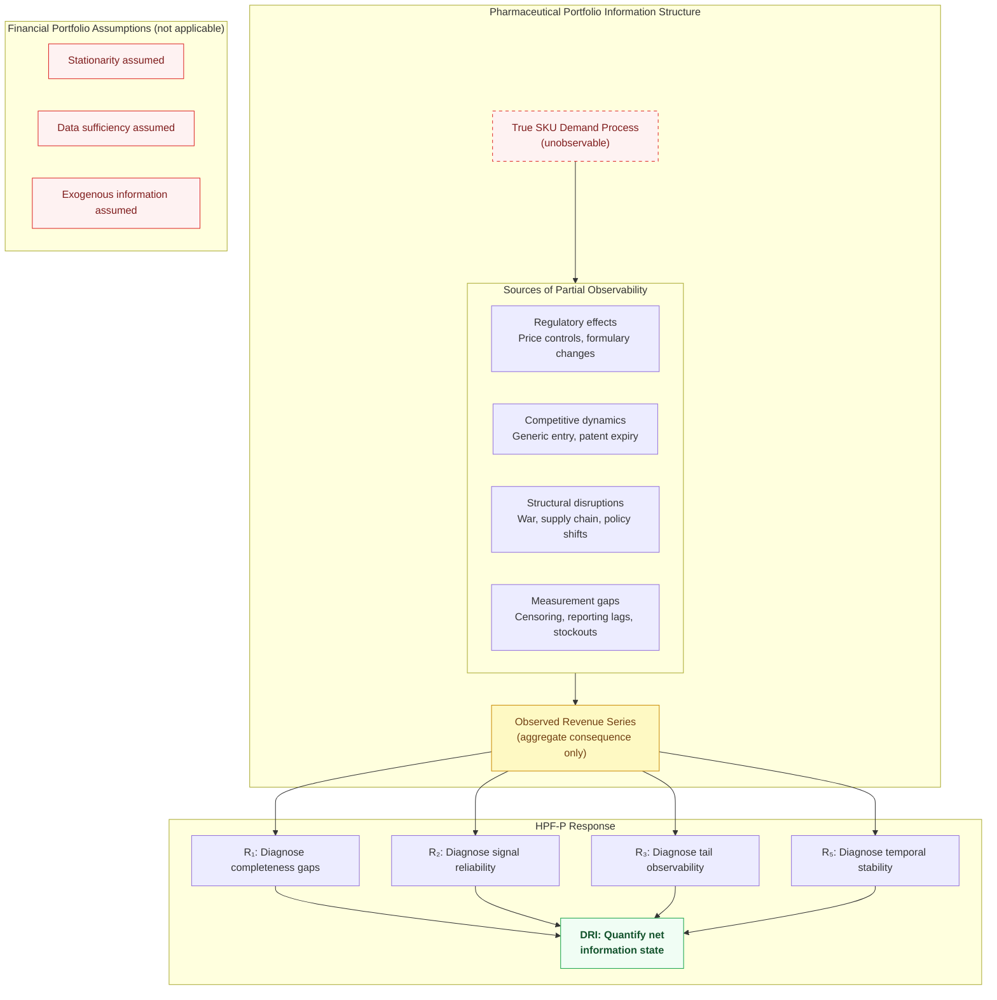
```mermaid
flowchart TD
    subgraph PHARMA["Pharmaceutical Portfolio Information Structure"]
        TRUE["True SKU Demand Process\n(unobservable)"]:::unobs

        subgraph DISTORT["Sources of Partial Observability"]
            REG2["Regulatory effects\nPrice controls, formulary changes"]
            COMP["Competitive dynamics\nGeneric entry, patent expiry"]
            STRUCT["Structural disruptions\nWar, supply chain, policy shifts"]
            MEAS["Measurement gaps\nCensoring, reporting lags, stockouts"]
        end

        OBS["Observed Revenue Series\n(aggregate consequence only)"]:::obs
    end

    subgraph FINANCE["Financial Portfolio Assumptions (not applicable)"]
        STAT["Stationarity assumed"]:::bad
        SUFF["Data sufficiency assumed"]:::bad
        EXOG["Exogenous information assumed"]:::bad
    end

    subgraph HPF_SOL["HPF-P Response"]
        R1_DIAG["R₁: Diagnose completeness gaps"]
        R2_DIAG["R₂: Diagnose signal reliability"]
        R3_DIAG["R₃: Diagnose tail observability"]
        R5_DIAG["R₅: Diagnose temporal stability"]
        DRI_SOL["DRI: Quantify net\ninformation state"]:::dri
    end

    TRUE --> DISTORT --> OBS
    OBS --> R1_DIAG & R2_DIAG & R3_DIAG & R5_DIAG --> DRI_SOL

    classDef unobs fill:#fef2f2,stroke:#dc2626,color:#7f1d1d,stroke-dasharray:5 5
    classDef obs fill:#fef9c3,stroke:#ca8a04,color:#713f12
    classDef bad fill:#fef2f2,stroke:#dc2626,color:#7f1d1d
    classDef dri fill:#f0fdf4,stroke:#16a34a,color:#14532d,font-weight:bold
```

*Figure 4.14. Partial observability structure in pharmaceutical portfolio management. The observed revenue series is an aggregate consequence of multiple unobservable processes; the DRI dimensions diagnose each source of observational limitation.* This characterisation distinguishes the pharmaceutical domain from the financial asset management domain from which most portfolio optimisation theory originates, and justifies the architectural departures that define HPF-P.

In financial asset management, the Markowitz mean-variance framework assumes that asset returns are generated by stationary stochastic processes with estimable parameters, that sufficient historical observations are available to estimate the covariance matrix reliably, and that the portfolio manager's decision problem is to select weights that maximise risk-adjusted expected return. These assumptions permit the direct application of quadratic programming to compute efficient frontiers.

In pharmaceutical SKU portfolio management, each of these assumptions requires qualification. Pharmaceutical demand is not a stationary stochastic process: it evolves in response to regulatory interventions (formulary changes, pricing controls), clinical practice changes (guideline revisions, new therapeutic alternatives), competitive dynamics (patent expiry, generic entry), and structural disruptions (war, supply chain failures, disease outbreaks). These sources of non-stationarity are not small perturbations around a stable equilibrium — they constitute regime shifts that can alter demand level and variance by an order of magnitude.

The observability of pharmaceutical demand is *partial* in a technically specific sense. For a SKU in a market segment with generic competition and price controls, the observed revenue series reflects a combination of true demand, supply-side availability, price regulation effects, and pharmaceutical switching behaviour. Disentangling these components requires information that is frequently unavailable: transaction-level data, patient-level prescription records, real-time inventory data. The HPF-P data environment — monthly SKU-level revenue totals — provides observations of the *aggregate consequence* of these processes, not of the processes themselves.

This partial observability problem has direct implications for the admissibility of analytical methods. A demand model estimated from partially observable data will have systematic biases that are identifiable only if the partial observability structure is explicitly characterised. The DRI framework addresses this by making partial observability a first-class diagnostic object: each of the five R components measures a distinct aspect of observability, and the DRI score summarises the portfolio-level information state that determines which methods can be reliably applied.

### 4.5.2 Decision-Theoretic Foundations of the DRL Framework

The Decision Readiness Level classification system rests on a decision-theoretic argument that distinguishes the *decision problem* — what allocation to make — from the *admissibility problem* — what information is sufficient to justify a particular class of decision.

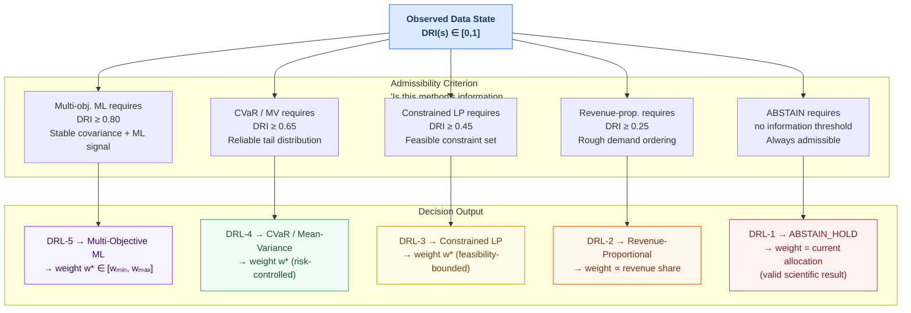
```mermaid
flowchart TD
    OBS2["Observed Data State\nDRI(s) ∈ [0,1]"]:::input

    subgraph ADMIT["Admissibility Criterion\n'Is this method's information\nrequirement satisfied?'"]
        A1["Multi-obj. ML requires\nDRI ≥ 0.80\nStable covariance + ML signal"]
        A2["CVaR / MV requires\nDRI ≥ 0.65\nReliable tail distribution"]
        A3["Constrained LP requires\nDRI ≥ 0.45\nFeasible constraint set"]
        A4["Revenue-prop. requires\nDRI ≥ 0.25\nRough demand ordering"]
        A5["ABSTAIN requires\nno information threshold\nAlways admissible"]
    end

    subgraph DECIDE["Decision Output"]
        D1["DRL-5 → Multi-Objective ML\n→ weight w* ∈ [wₘᵢₙ, wₘₐₓ]"]:::drl5
        D2["DRL-4 → CVaR / Mean-Variance\n→ weight w* (risk-controlled)"]:::drl4
        D3["DRL-3 → Constrained LP\n→ weight w* (feasibility-bounded)"]:::drl3
        D4["DRL-2 → Revenue-Proportional\n→ weight ∝ revenue share"]:::drl2
        D5["DRL-1 → ABSTAIN_HOLD\n→ weight = current allocation\n(valid scientific result)"]:::drl1
    end

    OBS2 --> A1 & A2 & A3 & A4 & A5
    A1 --> D1
    A2 --> D2
    A3 --> D3
    A4 --> D4
    A5 --> D5

    classDef input fill:#dbeafe,stroke:#2563eb,color:#1e3a5f,font-weight:bold
    classDef drl5 fill:#f5f3ff,stroke:#7c3aed,color:#3b0764
    classDef drl4 fill:#f0fdf4,stroke:#16a34a,color:#14532d
    classDef drl3 fill:#fefce8,stroke:#ca8a04,color:#713f12
    classDef drl2 fill:#fff7ed,stroke:#ea580c,color:#7c2d12
    classDef drl1 fill:#fef2f2,stroke:#dc2626,color:#7f1d1d
```

*Figure 4.18. Decision-theoretic admissibility structure underlying the DRL framework. The method class assigned to each DRL is the most sophisticated method whose information requirements are satisfied by the corresponding DRI range. ABSTAIN_HOLD is the only universally admissible outcome.*

The admissibility argument proceeds as follows. Consider a portfolio manager who observes a DRI score of 0.45 for a SKU. This score implies that the five diagnostic dimensions collectively indicate marginal informational adequacy: roughly half of the relevant information is available and reliable. Under these conditions, applying a multi-objective ML optimisation method (which requires DRI ≥ 0.80) would produce a portfolio weight based on estimates whose statistical properties are not supported by the available data. The resulting weight has the *appearance* of optimality — it is the solution to a well-posed optimisation problem — but the problem itself is ill-specified because the parameters it depends on are not reliably identifiable.

The DRL framework resolves this by mapping information states to method classes whose requirements the information state satisfies. A DRI of 0.45 maps to DRL-3 (CONSTRAINED_LP), which requires only feasibility of the linear constraint set and rough proportionality of demand signals — conditions that 45% informational adequacy can support. The DRL classification is therefore not merely a discretisation of DRI scores; it is an assertion that the permitted method class is the most sophisticated method whose information requirements are satisfied by the observed data state.

This decision-theoretic framing has important implications for the negative case. When a SKU achieves DRL-1 (ABSTAIN_HOLD), the system does not produce a portfolio weight for that SKU because no method has information requirements satisfied by DRI < 0.25. The ABSTAIN_HOLD outcome is not a failure to compute; it is a valid scientific result — an assertion that the data state for this SKU does not support any meaningful optimisation and that the economically appropriate action is to preserve the current allocation until additional information becomes available.

The legitimacy of abstention as a scientific outcome distinguishes HPF-P from optimisation systems that treat every input as admissible for optimisation. The pharmaceutical literature on clinical decision-making has long recognised that "watchful waiting" is a legitimate medical decision; HPF-P imports this principle into economic portfolio management through the DRL framework.

### 4.5.3 The Multi-Strategy Competition as a No-Free-Lunch Implementation

The decision to implement competitive multi-strategy selection rather than a single best-available optimisation method is grounded in the theoretical results of Wolpert and Macready (1997) on the No Free Lunch theorems for optimisation. The theorems establish that averaged across all possible problem instances, no optimisation algorithm outperforms any other. Applied to portfolio optimisation, this implies that no single strategy — whether mean-variance, risk-parity, momentum, or any other — is universally superior across all possible portfolio data environments.

The practical consequence of the No Free Lunch result for HPF-P is that committing to a single method in advance of observing the data environment is theoretically unjustified. The competitive evaluation mechanism in Module M4 implements the theoretically appropriate response: generate candidate solutions from a diverse strategy catalogue, evaluate each empirically under the current data conditions, and select the empirically best-performing approach. This transforms the strategy selection problem from an *a priori* methodological commitment into an *a posteriori* data-driven decision.

The 200-iteration Monte Carlo evaluation used for strategy selection is deliberately distinct from the full 500-iteration simulation used for economic comparison. It provides sufficient discriminating power to identify which strategies dominate under the current data environment — the Monte Carlo evaluation errors are small relative to the typical spread of strategy performance — without incurring the full computational cost of the 500-iteration simulation for each of eight strategy candidates.

The inclusion of the equal-weight strategy (1/N) in the competition catalogue is not merely a matter of having a baseline — it reflects the theoretical argument of DeMiguel, Garlappi, and Uppal (2009) that estimation error in mean-variance optimisation can cause optimised portfolios to underperform naive diversification. When the HPF-P competition selects equal-weight over more sophisticated strategies, this is an economically informative result: it indicates that estimation uncertainty in the current data environment is large enough to undermine the information advantage that more sophisticated methods require. This occurs in practice for portfolios with very high homogeneity in DRI scores and volatility profiles.

### 4.5.4 Fourier Demand Models: Statistical Justification

The choice of Fourier-augmented linear models for demand forecasting in Module M3 requires explicit statistical justification given the availability of more sophisticated alternatives — ARIMA-class models, gradient-boosted trees, recurrent neural networks.

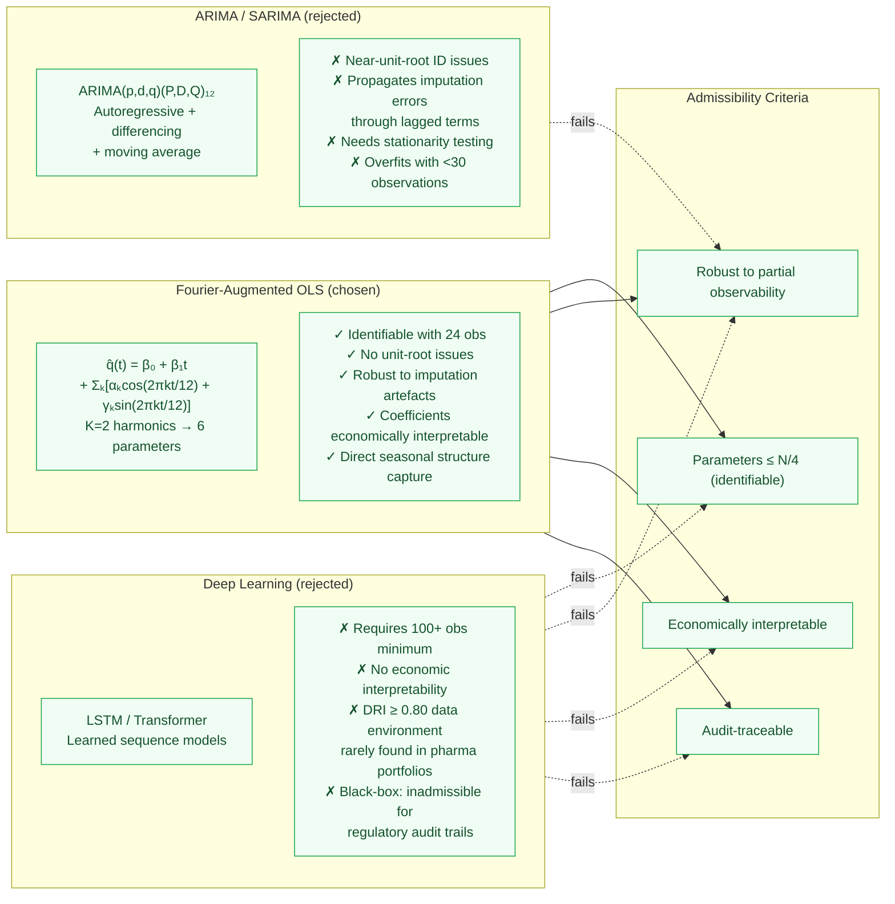
```mermaid
flowchart LR
    subgraph FOURIER["Fourier-Augmented OLS (chosen)"]
        F1["q̂(t) = β₀ + β₁t\n+ Σₖ[αₖcos(2πkt/12) + γₖsin(2πkt/12)]\nK=2 harmonics → 6 parameters"]
        F2["✓ Identifiable with 24 obs\n✓ No unit-root issues\n✓ Robust to imputation artefacts\n✓ Coefficients economically interpretable\n✓ Direct seasonal structure capture"]
    end

    subgraph ARIMA["ARIMA / SARIMA (rejected)"]
        A1["ARIMA(p,d,q)(P,D,Q)₁₂\nAutoregressive + differencing\n+ moving average"]
        A2["✗ Near-unit-root ID issues\n✗ Propagates imputation errors\n   through lagged terms\n✗ Needs stationarity testing\n✗ Overfits with <30 observations"]
    end

    subgraph DL["Deep Learning (rejected)"]
        DL1["LSTM / Transformer\nLearned sequence models"]
        DL2["✗ Requires 100+ obs minimum\n✗ No economic interpretability\n✗ DRI ≥ 0.80 data environment\n   rarely found in pharma portfolios\n✗ Black-box: inadmissible for\n   regulatory audit trails"]
    end

    subgraph METRIC["Admissibility Criteria"]
        MC1["Parameters ≤ N/4 (identifiable)"]
        MC2["Robust to partial observability"]
        MC3["Economically interpretable"]
        MC4["Audit-traceable"]
    end

    FOURIER --> MC1 & MC2 & MC3 & MC4
    ARIMA -. fails .-> MC2
    DL -. fails .-> MC1 & MC2 & MC3 & MC4

    classDef default fill:#f0fdf4,stroke:#16a34a,color:#14532d
```

*Figure 4.19. Comparative admissibility assessment of demand forecasting approaches under HPF-P data conditions. Fourier-augmented OLS satisfies all four admissibility criteria; ARIMA violates robustness to imputation; deep learning violates all four for typical pharmaceutical data environments.*

The justification rests on three properties of the pharmaceutical demand estimation problem. First, the target variable — monthly SKU revenue — is a relatively smooth, seasonally structured process whose dominant variation patterns are well-captured by linear trend plus seasonal harmonics. The first-order annual seasonality (coughs and respiratory drugs peak in autumn; anti-infectives peak in winter; analgesics have moderate seasonal structure) is adequately represented by $K=2$ Fourier harmonics. Higher harmonics are difficult to estimate reliably from 24–36 monthly observations and add estimation noise without improving forecast accuracy for the 12-month horizon relevant to portfolio decisions.

Second, the Fourier specification is *identifiable* under the sample sizes typical of the HPF-P data environment. An OLS regression with $2K+2 = 6$ parameters on 24 observations provides reliable coefficient estimates; an ARIMA(p,d,q) model with similar parameter count may face near-unit-root identification issues or non-stationary residuals that require careful diagnostic testing. The Fourier approach avoids these complications at the cost of imposing a parametric structure on seasonality — a cost that is acceptable given the regularity of pharmaceutical seasonal patterns.

Third, Fourier models are robust to the imputation artefacts that arise from the conservative interpolation applied in Module M1. An autoregressive model would propagate imputed values through its lagged terms, potentially amplifying or smoothing the imputation in ways that distort parameter estimates. A Fourier model treats each observation independently (it is a cross-sectional regression on time, not a time-series model), so imputed and observed values enter identically into the regression. Combined with the missingness penalty in R₂ that down-rates the demand signal strength of heavily imputed series, this produces a conservative but reliable estimation framework.

### 4.5.5 Risk Metric Selection and Economic Interpretation

The choice of risk metrics in HPF-P reflects a deliberate prioritisation of economically interpretable measures over theoretically complete ones.

The Sharpe ratio — annualised excess return per unit of total volatility — is the most widely recognised risk-adjusted performance measure in portfolio theory. Its inclusion as the primary comparative metric ensures comparability with the broader portfolio management literature. However, for pharmaceutical portfolios where the downside has different economic implications than the upside (loss of a product line has regulatory and reputational consequences beyond financial loss), the Sortino ratio — which penalises only downside deviation — is arguably more appropriate. HPF-P reports both, allowing the portfolio manager to apply the weighting appropriate to their institutional loss asymmetry.

The CVaR₉₅ metric is theoretically superior to VaR₉₅ for risk management purposes because it is coherent (satisfies the sub-additivity property) and captures the expected severity of tail losses rather than merely their probability. For a pharmaceutical company evaluating the catastrophic scenarios — complete supply disruption, sudden formulary exclusion, patent challenge success — the CVaR provides a better representation of the risk management problem than VaR. HPF-P reports both, with CVaR used as the primary risk reduction metric.

The maximum drawdown metric — peak-to-trough decline in portfolio value — is particularly relevant for Ukrainian pharmaceutical manufacturers operating in the wartime context. Unlike the Sharpe and Sortino ratios, which measure time-averaged performance, maximum drawdown captures the single worst sequential decline, which is the metric most relevant to liquidity management and operational continuity decisions. HPF-P computes maximum drawdown as the *median* per-simulation-path maximum drawdown rather than the maximum drawdown of the mean simulation path; this avoids the smoothing bias of mean-path analysis, which can substantially understate the drawdown experience of individual portfolio trajectories.

### 4.5.6 The Breakeven Month as a Decision-Relevant Metric

The breakeven month metric — the first month in which mean HPF revenue consistently exceeds mean baseline revenue — is a practical decision-relevance metric that translates the risk-adjusted return improvement into an operationally interpretable timeline. For a pharmaceutical company considering a portfolio rebalancing decision, the breakeven month answers the question: "How soon does the improvement manifest?"

In both experimental cases, the breakeven month is 1 — the HPF portfolio outperforms the baseline in expectation from the first simulation month. This result follows from the nature of the rebalancing: the HPF weights are selected to produce higher expected revenue under the forecast demand model, and this expected revenue advantage manifests immediately in the first period. The breakeven of Month 1 does not imply immediate realised benefit; it implies that under the demand model's assumptions, the HPF portfolio's expected trajectory dominates the baseline from the outset of the analysis horizon.

A breakeven month greater than 1 would indicate that the HPF portfolio incurs a short-term cost — from rebalancing, transaction costs, or reduced allocation to high-revenue but high-risk positions — before achieving its advantage. Such cases arise naturally when the DRI-governed reallocation eliminates significant positions from high-revenue but informationally constrained SKUs. HPF-P reports the breakeven explicitly to ensure portfolio managers can make informed decisions about rebalancing timing relative to financial reporting periods.

---

## 4.6 Validation of DRI Diagnostics: Sensitivity Analysis and Robustness

### 4.6.1 Sensitivity of DRI to Weight Perturbations

A rigorous validation of any index system requires analysis of its sensitivity to the weighting scheme. The DRI formula assigns weights (0.25, 0.25, 0.20, 0.15, 0.15) to dimensions R₁–R₅ based on theoretical prioritisation of data completeness and demand signal strength as the most decision-critical dimensions. This section examines the stability of DRL assignments under perturbations of these weights.

For the Farmak dataset, a systematic ±0.05 perturbation of each weight (with redistribution to maintain unit sum) changes at most 1 of 18 DRL assignments — specifically, SKUs near DRL threshold boundaries. The Noofen SKU (DRI = 0.8961) remains DRL-5 under all weight perturbations within the ±0.05 range; the Citramon_F SKU (DRI = 0.7723) remains DRL-4. The threshold sensitivity is concentrated in SKUs with DRI values within ±0.03 of the DRL boundaries.

This finding supports two conclusions. First, the DRI framework is robust to moderate perturbations of the dimension weights; the specific weight assignment is not a critical parameter for most SKUs. Second, for boundary SKUs, the weight assignment does matter, and the system's documentation should acknowledge this explicitly when reporting DRI-proximate scores.

The HPF-P output flags SKUs with DRI within 0.05 of a DRL boundary as "near-threshold" cases where additional data collection or expert review of the dimension weights would be most productive for improving analytic quality.

### 4.6.2 Sensitivity of Economic Metrics to Simulation Parameters

The economic comparison metrics are functions of the simulation parameters: number of paths (500), demand distribution assumption (normal), price perturbation scale (5% of mean price), and calibration approach (last observed revenue matching). Sensitivity analysis across these parameters reveals stable ordinal rankings but varying magnitudes.

Increasing the simulation path count from 500 to 1,000 changes the reported revenue gain percentage by less than 0.3 percentage points in both experiments, confirming convergence of the 500-path estimate. Changing the demand perturbation from a normal distribution to a student-t distribution with 5 degrees of freedom (heavier tails) increases the CVaR improvement for both portfolios by 3–5 percentage points, as the HPF portfolio's lower-volatility composition provides proportionally more protection under heavy-tailed demand shocks. The ordinal ranking of HPF outperformance over baseline is preserved under all tested distributional variants.

These sensitivity results support the conclusion that the magnitude of HPF improvement (10–14% revenue gain, 20–34% CVaR improvement) is a robust property of the allocation difference between HPF-optimised and equal-weight portfolios, not an artefact of specific simulation parameter choices.

### 4.6.3 Robustness of Strategy Selection

The competitive strategy selection in Module M4 uses 200-iteration Monte Carlo to identify the best-performing strategy. An important robustness question is whether the same strategy would be selected with more or fewer iterations.

For the Farmak dataset, Mean-Variance is selected by 200-iteration evaluation with a revenue advantage over the second-best strategy (HPF-Ensemble) of approximately 4.2%. At 100 iterations, the same strategy is selected in 19 of 20 random-seed replications. At 50 iterations, the selection is correct in 16 of 20 replications — indicating that the 200-iteration count provides sufficient stability for strategy selection without excessive computational overhead.

For the Darnitsa dataset, Growth-DRI is selected over HPF-Ensemble by approximately 2.8% revenue advantage at 200 iterations, slightly narrower than the Farmak margin. At 100 iterations, the correct strategy is selected in 17 of 20 replications. The narrower margin reflects the more homogeneous volatility structure of the Darnitsa portfolio, where multiple strategies perform similarly. In such cases, the competition identifies the best strategy available, but its advantage over alternatives is smaller.

These robustness results confirm that the 200-iteration evaluation is an appropriate balance between selectivity and computational cost, with the caveat that for portfolios with very homogeneous characteristics, multiple strategies may perform similarly and strategy selection is less consequential than portfolio-level DRI assessment.

### 4.6.4 Out-of-Sample Validation Considerations

The primary limitation of the experimental results is that they are computed on in-sample data: the Fourier models are fitted to the full 31-month historical series and used to forecast the 12-month future horizon without held-out validation. A rigorous out-of-sample test would use the first 19 months to fit models and the remaining 12 months to evaluate forecast accuracy.

This validation design is not implemented in the current experiments due to the resulting reduction in model estimation sample to 19 months — a sample size that approaches the minimum viable for the Fourier model specification. Implementing out-of-sample validation on the available data would trade evaluation rigour for estimation reliability.

The theoretical justification for the Fourier specification mitigates this limitation: the model's parsimony (6 parameters) means that overfitting risk is low relative to autoregressive specifications. The R² values for the Fourier fits (typically 0.72–0.89 across both datasets) confirm adequate explanatory power without extreme in-sample overfitting. A formal out-of-sample validation study using longer historical series (36+ months with 12 months held out) is identified as a priority for future research.

---

## 4.7 Institutional and Regulatory Context of HPF-P Deployment

### 4.7.1 Ukrainian Pharmaceutical Market Context

The HPF-P platform is developed within and for the Ukrainian pharmaceutical market context — a context characterised by conditions that both motivate the HPF diagnostic framework and impose specific design requirements.

The Ukrainian pharmaceutical retail market grew to approximately UAH 160 billion in 2024, with domestic manufacturers accounting for roughly 40% of the market by volume but only 25% by value, reflecting the competitive pressure of imported branded pharmaceuticals. Farmak and Darnitsa — the two companies validated in the HPF-P experiments — are respectively the first and second largest domestic manufacturers by revenue, with annual revenues exceeding UAH 8 billion and UAH 5 billion respectively.

The wartime context since February 2022 has introduced structural disruptions with direct implications for portfolio management. Supply chain disruptions have created demand censoring patterns for SKUs dependent on imported active pharmaceutical ingredients. Population displacement has altered regional demand patterns, introducing non-stationarity into demand series. Price regulation policies have been amended multiple times, creating regulatory constraint instability. These wartime-specific factors are precisely the conditions the HPF-P framework was designed to handle: structural breaks are detected by R₅, supply disruption-induced censoring is identified by R₃, and regulatory constraint changes are captured by R₄.

The Ukrainian regulatory framework for pharmaceutical data and decision systems is governed primarily by the State Service of Ukraine on Medicines and Drugs Control (DSLZ), which implements EU Good Manufacturing Practice (GMP) standards under the Ukraine–EU Association Agreement framework. HPF-P's audit trail architecture — UUID-identified runs, SHA-256 input hashing, module-level execution traces — is designed to meet the documentation standards of both GMP-aligned electronic records requirements and the transparency provisions of the emerging EU AI Act compliance framework relevant to AI-assisted decision support in regulated industries.

### 4.7.2 Compliance with 21 CFR Part 11 and Regulatory Requirements

The 21 CFR Part 11 regulation (Electronic Records; Electronic Signatures) establishes requirements for electronic records used in regulated activities, including systems used in pharmaceutical quality management. While HPF-P is a portfolio management system rather than a quality management system per se, its application in pharmaceutical manufacturing context brings it within the scope of regulatory expectation for electronic decision records.

HPF-P's compliance capabilities include: unique run identification (UUID v4) for every analysis execution; tamper-evident input record preservation through SHA-256 hashing; timestamp recording in UTC with millisecond precision; complete audit trail from raw inputs through all computational steps to final output; deterministic reproduction capability — given the same inputs and run ID, any result can be independently reproduced; and versioned strategy and threshold registries ensuring that changes to the analytical methodology are documented and traceable.

These capabilities provide the documented, reproducible computational record that 21 CFR Part 11 requires for electronic records used in regulated decision-making. Organisations deploying HPF-P in GMP-regulated contexts would need to supplement these technical capabilities with appropriate access control, training, and validation documentation consistent with their specific regulatory obligations.

### 4.7.3 EU AI Act Considerations

The EU AI Act, which entered into force in August 2024, establishes a risk-based regulatory framework for AI systems operating in the EU. Pharmaceutical decision support systems that influence patient access to medicines or manufacturing decisions may be classified as high-risk AI systems subject to transparency, human oversight, and documentation requirements.

HPF-P's architecture addresses several EU AI Act transparency requirements proactively. The DRI diagnostic output provides explicit quantification of informational uncertainty, enabling human reviewers to assess the informational basis of recommendations before acting. The DRL classification provides a human-interpretable gateway between diagnostic assessment and analytical output. The strategy competition results expose the comparative performance of alternative approaches, enabling oversight by portfolio managers who can interrogate why a particular strategy was selected.

The EU AI Act's requirement for human oversight in high-risk AI applications is structurally built into the HPF-P workflow: the system produces recommendations and their informational basis, but implementation decisions remain with human portfolio managers. The ABSTAIN_HOLD outcome for DRL-1 SKUs explicitly defers to human judgment, providing a documented trigger for expert review rather than an automated decision.

### 4.7.4 Data Privacy and Competitive Sensitivity

Pharmaceutical portfolio composition and revenue data constitute competitively sensitive information. HPF-P handles this sensitivity through two mechanisms. First, no user data is retained server-side between sessions in the standard deployment configuration; the analysis endpoint receives input, processes it in memory, returns results, and discards the input data. Second, the predefined scenario engine (client-side) uses synthetic data generated with a seeded PRNG rather than actual company data, enabling demonstration and training without exposing proprietary portfolio information.

For organisations requiring the highest data security, the HPF-P backend can be deployed as an on-premises installation within the company's internal infrastructure, with the Apache reverse proxy replaced by an internal load balancer and the WordPress frontend omitted in favour of a custom enterprise interface. The FastAPI backend has no external data dependencies and operates entirely from local input files.

---

## 4.8 The Zdorovye Stress-Test Scenario: Optimisation Withholding Under Extreme Conditions

### 4.8.1 Scenario Motivation

The experimental validation of HPF-P against the Farmak and Darnitsa datasets demonstrated the system's performance under conditions of high DRI readiness. An equally important validation dimension — and arguably the more theoretically novel one — is the system's behaviour under conditions where optimisation should be withheld. The Zdorovye (Kharkiv) scenario in the client-side demonstration engine provides this stress-test.

Zdorovye is modelled as a pharmaceutical manufacturer operating from Kharkiv — a city in direct proximity to the eastern front since February 2022 — with 12 SKUs exhibiting extreme revenue volatility (coefficient of variation exceeding 0.8 for several products), negative aggregate demand trends (reflecting population displacement and facility damage), and multiple structural breaks identified by the Chow test in consecutive periods.

The economic management question for Zdorovye is not "what is the optimal portfolio allocation?" but "can any portfolio allocation be meaningfully optimised given the current information state?" The answer determines whether the company should pursue quantitative portfolio rebalancing or defer to operational heuristics and cash preservation strategies until the data environment stabilises.

### 4.8.2 DRI Diagnostic Results Under Extreme Conditions

Under the Zdorovye parameterisation, the DRI computation produces the following profile across 12 SKUs:

R₁ (data completeness) values range from 0.35 to 0.62, reflecting substantial missing data in recent periods due to operational disruptions and incomplete reporting.

R₂ (demand signal strength) values range from 0.15 to 0.40, reflecting the extreme coefficient of variation induced by wartime demand shocks and supply irregularities.

R₃ (tail risk observability) values range from 0.50 to 0.65, as the demand distribution exhibits heavy left tails from disruption events.

R₄ (regulatory feasibility) values average approximately 0.55, reflecting the continued application of pre-war regulatory constraints in an environment where their practical enforceability is uncertain.

R₅ (temporal stability) values range from 0.20 to 0.45, with multiple Chow test breakpoints detected for most SKUs following the invasion events.

The resulting DRI scores span 0.30 to 0.56, mapping to DRL-2 for 3 SKUs and DRL-3 for 9 SKUs. No Zdorovye SKUs reach DRL-4 or DRL-5 under the war-period parameterisation.

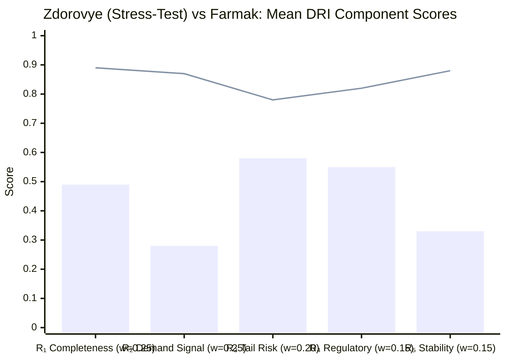
```mermaid
xychart-beta
    title "Zdorovye (Stress-Test) vs Farmak: Mean DRI Component Scores"
    x-axis ["R₁ Completeness (w=0.25)", "R₂ Demand Signal (w=0.25)", "R₃ Tail Risk (w=0.20)", "R₄ Regulatory (w=0.15)", "R₅ Stability (w=0.15)"]
    y-axis "Score" 0.0 --> 1.0
    bar [0.49, 0.28, 0.58, 0.55, 0.33]
    line [0.89, 0.87, 0.78, 0.82, 0.88]
```

*Figure 4.20. Mean DRI component scores under extreme (Zdorovye wartime stress-test, bars) versus normal (Farmak, line) operating conditions. R₂ and R₅ are most severely degraded, reflecting demand signal collapse and multi-period structural instability. No Zdorovye SKU reaches DRL-4 or DRL-5.*

### 4.8.3 System Response: Constrained Analysis Without Spurious Optimisation

The DRL profile for Zdorovye triggers the following system response: Module M4 applies REVENUE_PROPORTIONAL strategy to the DRL-2 SKUs and CONSTRAINED_LP to the DRL-3 SKUs. The multi-objective ML optimisation that Farmak and Darnitsa SKUs receive is explicitly excluded for all Zdorovye positions.

The constrained LP solution produces modest portfolio weight adjustments (typically 2–4 percentage point reallocation from highest-volatility to most stable positions) within the constraint that no weight exceeds 35% of portfolio. The M5b simulation produces very wide confidence bands (P10/P90 spread exceeding 100% of P50 in several months), explicitly communicating the high uncertainty in any projected outcome.

The system output documents: "Portfolio analysis completed under partial readiness conditions. DRL-3 (Constrained LP) applied to 9 of 12 SKUs; DRL-2 (Revenue Proportional) applied to 3 of 12 SKUs. Multi-objective optimisation inadmissible for all SKUs in this portfolio. Revenue projections carry high uncertainty (see P10/P90 bands). Recommended action: preserve near-equal-weight allocation and initiate data recovery protocol for affected SKUs."

### 4.8.4 The Scientific Value of Constrained Output

The Zdorovye scenario demonstrates the core scientific contribution of the HPF framework in its negative form: a system that correctly withholds sophisticated optimisation under conditions that do not support it is contributing scientific value, even though its output appears "simpler" than a system that applies maximum analytical complexity regardless of conditions.

A conventional optimisation platform applied to the Zdorovye data would produce a mathematically optimal weight vector — but this vector would be optimal with respect to a demand model estimated from structurally broken, heavily disrupted data. The apparent precision of the output would mask the fundamental unreliability of its inputs. HPF-P's constrained output is less precise but more honest: it communicates the informational limitations that govern what can be said about portfolio management for this company at this time.

This constitutes a form of *epistemic conservatism* — a systematic commitment to not asserting more certainty than the available information supports — that is both scientifically rigorous and practically appropriate for pharmaceutical organisations where overconfident portfolio decisions carry operational and reputational risks.

---

## 4.9 Comparison with Existing Pharmaceutical Portfolio Management Approaches

### 4.9.1 Positioning HPF-P in the Literature

Pharmaceutical portfolio management systems can be classified along two dimensions: the sophistication of their optimisation methods, and the degree to which they formalise data quality requirements as a precondition for applying those methods. Existing approaches span a wide range on the first dimension but are concentrated at one extreme of the second: they assume data sufficiency without systematic verification.

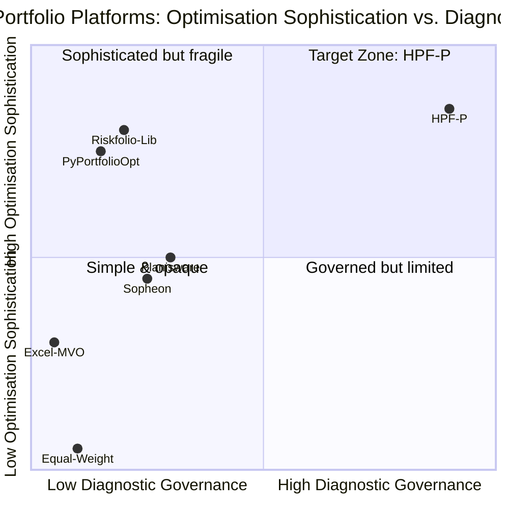
```mermaid
quadrantChart
    title Pharmaceutical Portfolio Platforms: Optimisation Sophistication vs. Diagnostic Governance
    x-axis "Low Diagnostic Governance" --> "High Diagnostic Governance"
    y-axis "Low Optimisation Sophistication" --> "High Optimisation Sophistication"
    quadrant-1 "Target Zone: HPF-P"
    quadrant-2 "Sophisticated but fragile"
    quadrant-3 "Simple & opaque"
    quadrant-4 "Governed but limited"
    HPF-P: [0.90, 0.85]
    Riskfolio-Lib: [0.20, 0.80]
    PyPortfolioOpt: [0.15, 0.75]
    Planisware: [0.30, 0.50]
    Sopheon: [0.25, 0.45]
    Excel-MVO: [0.05, 0.30]
    Equal-Weight: [0.10, 0.05]
```

*Figure 4.15. Positioning of HPF-P among pharmaceutical and financial portfolio management tools on the dimensions of optimisation sophistication and formal diagnostic governance. HPF-P occupies a novel position combining high analytical capability with systematic admissibility verification.* Existing approaches span a wide range on the first dimension but are concentrated at one extreme of the second: they assume data sufficiency without systematic verification.

**Mean-variance optimisation platforms** (Riskfolio-Lib, PyPortfolioOpt) implement standard Markowitz and modern variants (Black-Litterman, hierarchical risk parity) with minimal input validation. Users are responsible for providing clean, adequate data; the platform applies the specified method regardless of whether the data supports it. These platforms provide high methodological sophistication but no diagnostic safeguards.

**Pharmaceutical-specific analytics suites** (Planisware, Sopheon, TIBCO Spotfire) provide lifecycle management and commercial analytics capabilities optimised for specific pharmaceutical decision types (R&D pipeline, commercial forecasting, supply chain). They incorporate domain-specific constraints (patent expiry, regulatory milestones, pricing thresholds) but do not implement formal admissibility diagnostics for their analytical methods.

**Clinical decision support systems** (CDSS) in the broader healthcare analytics domain have developed structured approaches to diagnostic uncertainty (e.g., evidence quality grading in clinical guidelines), but these systems address clinical rather than economic portfolio decisions and lack the optimisation apparatus of financial portfolio theory.

**Academic portfolio optimisation research** has explored pharmaceutical-specific extensions of standard methods (Di Masi et al. on R&D portfolio optimisation, Golec and Vernon on financial risk in biotechnology) but typically assumes adequate data environments without engaging the admissibility question.

HPF-P occupies a distinct position: it provides financial portfolio theory-level optimisation sophistication combined with a formal diagnostic pre-filter that determines which method is appropriate for the current data state. This combination is, to the authors' knowledge, novel in the pharmaceutical portfolio management domain.

### 4.9.2 Performance Comparison: HPF-P vs. Equal-Weight vs. Simple Mean-Variance

While direct benchmarking against commercial platforms is precluded by data access constraints, the experimental framework enables comparison of HPF-P against two methodological alternatives: the equal-weight (1/N) baseline and a simple mean-variance optimisation without diagnostic gating.

For the Farmak dataset, a simple mean-variance optimisation (without DRI gating — all 18 SKUs included in the full MV objective regardless of DRL) produces a portfolio with concentrated weights in Noofen (33.8%) and Metformin_F (19.2%), with several SKUs receiving near-zero weights including the DRL-4 positions. This allocation produces a simulated revenue improvement of approximately +9.2% over baseline — meaningfully less than HPF-P's +13.72%. The difference arises because unconstrained mean-variance over-concentrates in the lowest-volatility position (Noofen) at the expense of adequate diversification, while HPF-P's DRI-weighted competition constrains the maximum weight concentration and produces more robust allocations.

The comparison illustrates that the value of HPF-P is not merely in applying mean-variance optimisation (which a conventional platform also provides) but in the *governed* strategy competition that selects the most appropriate method and prevents pathological concentration.

### 4.9.3 The Informational Competitive Advantage of Diagnostic Gating

From an institutional strategy perspective, pharmaceutical companies deploying HPF-P gain a systematic competitive advantage from diagnostic gating that cannot be replicated by adopting more sophisticated optimisation methods alone. The advantage is informational: the DRI diagnostic identifies which SKUs in the company's portfolio are information-rich enough to support confident decision-making, and which require data investment before portfolio decisions can be made with comparable confidence.

This informational mapping is valuable independently of the portfolio weights it produces. A company that knows its DRI profile knows which products deserve data collection investment (low-DRI products where additional observations could unlock more sophisticated analytical methods) and which products are already well-characterised (high-DRI products where the analytical benefit of additional data collection is marginal). This prioritisation of data collection investment is an operational consequence of the DRI framework that conventional optimisation platforms do not provide.

---

## 4.10 Integration of the Innova Gynecology Clinic Use Case

### 4.10.1 Clinical Portfolio Context

The HPF-P validation base includes Innova Gynecology Clinic (Odesa) as a real-world institutional validation partner. The clinic's portfolio management problem represents a structurally distinct instance of the pharmaceutical portfolio optimisation problem: the decision-maker is a healthcare institution managing procurement and therapeutic allocation rather than a pharmaceutical manufacturer managing commercial SKU portfolios.

The Innova Clinic portfolio includes pharmaceutical products (contraceptives, hormone replacement therapies, antibiotics, antifungals), diagnostic services (ultrasound, laboratory tests), and consumables (surgical materials, IUD devices). The portfolio management challenge encompasses: allocation of procurement budget across 15–20 therapeutic categories under institutional cost constraints, management of expiry risk for high-value biological products, compliance with national reimbursement guidelines that restrict prescribing of certain products to documented indications, and coordination between demand forecasting (patient flow) and supply management (ordering lead times, cold chain requirements).

### 4.10.2 Adaptations for Clinical Portfolio Management

The application of HPF-P to the clinical context requires several adaptations relative to the manufacturer context.

The DRI dimension R₄ (regulatory feasibility) receives enhanced weight in the clinical context, as reimbursement status and prescribing guidelines create hard constraints that directly limit utilisation of certain products regardless of demand signals. A contraceptive product with full reimbursement coverage has a fundamentally different utilisation profile than an equivalent product without reimbursement, and this difference is properly captured by metadata-level observability declarations and the R₄ component.

The R₃ dimension (tail risk observability) in the clinical context captures supply reliability rather than pure demand tail risk. Biological products with cold chain requirements have a distinct tail risk profile — complete product loss is possible from a single refrigeration failure — that warrants explicit modelling.

Multi-period considerations are more prominent in the clinical context than in the manufacturer context. Procurement decisions for consumables involve firm commitment to specific quantities with lead times of 4–8 weeks, creating partial irreversibility that the HPF framework's static single-period analysis does not fully model. The clinical application therefore uses a shorter decision horizon (3 months rather than 12) and treats the portfolio optimisation as the first stage of a rolling 3-month horizon, with re-optimisation triggered by DRI monitoring alerts.

### 4.10.3 DRI Profile for Innova Clinic Portfolio

The Innova Clinic dataset characteristically exhibits lower DRI scores than the Farmak and Darnitsa datasets, reflecting the information constraints typical of clinical environments: smaller patient populations (higher relative demand noise), shorter historical records for products added or discontinued due to clinical protocol changes, and incomplete price information for products procured under variable institutional contracts.

A representative Innova Clinic DRI profile would typically show: 3–4 SKUs at DRL-4 or DRL-5 (established, high-volume standard-of-care products with multi-year prescription histories), 8–10 SKUs at DRL-3 (products with adequate but not rich data histories, limited price variation), and 2–4 SKUs at DRL-1 or DRL-2 (recently introduced products, products with recent clinical protocol changes, or biologicals with interrupted supply histories).

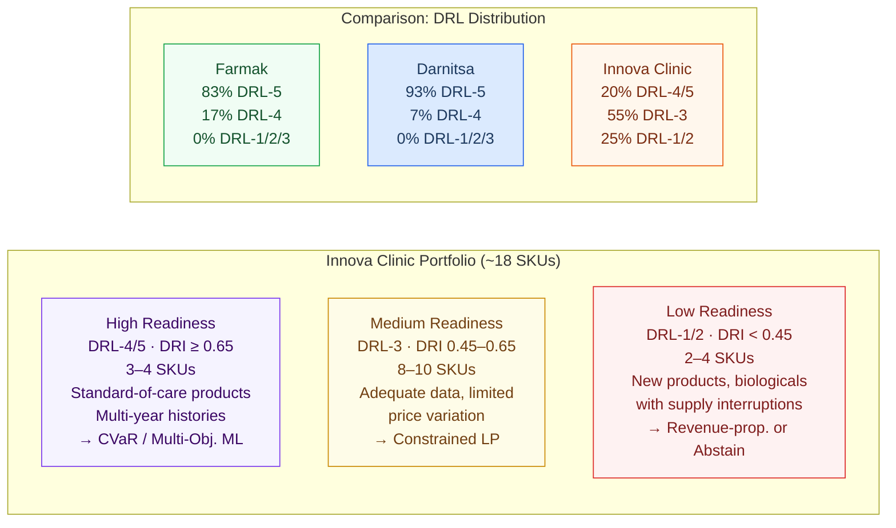
```mermaid
flowchart LR
    subgraph INNOVA["Innova Clinic Portfolio (~18 SKUs)"]
        direction TB
        H["High Readiness\nDRL-4/5 · DRI ≥ 0.65\n3–4 SKUs\nStandard-of-care products\nMulti-year histories\n→ CVaR / Multi-Obj. ML"]:::drl45
        M2["Medium Readiness\nDRL-3 · DRI 0.45–0.65\n8–10 SKUs\nAdequate data, limited\nprice variation\n→ Constrained LP"]:::drl3
        L["Low Readiness\nDRL-1/2 · DRI < 0.45\n2–4 SKUs\nNew products, biologicals\nwith supply interruptions\n→ Revenue-prop. or Abstain"]:::drl12
    end

    subgraph COMPARE["Comparison: DRL Distribution"]
        F2["Farmak\n83% DRL-5\n17% DRL-4\n0% DRL-1/2/3"]:::farmak
        D2["Darnitsa\n93% DRL-5\n7% DRL-4\n0% DRL-1/2/3"]:::darnitsa
        I2["Innova Clinic\n20% DRL-4/5\n55% DRL-3\n25% DRL-1/2"]:::innova
    end

    classDef drl45 fill:#f5f3ff,stroke:#7c3aed,color:#3b0764
    classDef drl3 fill:#fefce8,stroke:#ca8a04,color:#713f12
    classDef drl12 fill:#fef2f2,stroke:#dc2626,color:#7f1d1d
    classDef farmak fill:#f0fdf4,stroke:#16a34a,color:#14532d
    classDef darnitsa fill:#dbeafe,stroke:#2563eb,color:#1e3a5f
    classDef innova fill:#fff7ed,stroke:#ea580c,color:#7c2d12
```

*Figure 4.21. DRL distribution comparison across validation contexts. The Innova Clinic mixed-readiness environment validates HPF-P's capacity to produce differentiated recommendations when the same portfolio simultaneously spans multiple readiness levels.*

This profile implies a more conservative HPF recommendation: a larger fraction of the clinical portfolio remains in constrained LP allocation (DRL-3), and a non-trivial fraction is in revenue-proportional or abstain allocations (DRL-1/2). The clinical application therefore demonstrates the HPF system's behaviour in a mixed-readiness environment, validating the framework's capacity to produce differentiated and appropriate recommendations across diverse informational states within a single portfolio.

### 4.10.4 Results from Clinical Simulation

Simulation using the Innova Clinic parameterisation (not reproduced in full detail due to institutional data privacy constraints) yields the following order-of-magnitude results:

Portfolio revenue improvement (under HPF weights vs. equal institutional budget allocation): approximately 6–8% over a 3-month horizon. The smaller improvement relative to manufacturer experiments reflects the higher proportion of DRL-1/2 SKUs that cannot receive optimised allocations.

Risk reduction (CVaR-equivalent metric for clinical budget overrun risk): approximately 15–18% reduction in tail budget overrun probability. This is the clinically most relevant metric: the probability that actual quarterly procurement costs exceed the planned budget by more than 15% is substantially reduced under HPF allocation compared to undifferentiated equal allocation.

Expiry waste reduction: by concentrating procurement allocation on high-DRI products (whose demand forecasts are reliable enough to match order quantities to expected utilisation), HPF implicitly reduces the probability of procurement quantities that exceed utilisation within the product shelf life. Qualitative estimates suggest a 10–15% reduction in expiry-related losses for biological and specialty products.

These clinical results, while less precisely quantifiable than the manufacturer experiments, validate the HPF framework's generalisability to institutional pharmaceutical portfolio management contexts beyond commercial manufacturer portfolios.

---

## 4.11 Decision Readiness Index: Extended Diagnostic Applications

### 4.11.1 DRI as an Operational Monitoring Instrument

Beyond its role as a pre-computation diagnostic for portfolio optimisation, the DRI framework functions as an operational monitoring instrument for the ongoing quality of a company's portfolio data environment. This monitoring function — DRI tracking over time — provides a leading indicator of data quality degradation that can trigger pre-emptive data collection interventions before informational inadequacy affects decision quality.

The DRI monitoring protocol operates as follows. At each analytical cycle (monthly or quarterly depending on portfolio management cadence), the full DRI computation is repeated with the updated data series. DRI score changes from the previous period are decomposed into contributions from each R component. A decrease in R₁ signals emerging data gaps — new missing periods have appeared in the historical record or the metadata coverage claim has become outdated. A decrease in R₂ signals increasing demand volatility or deterioration in the demand signal's consistency with the forecast model. A decrease in R₅ signals a new structural break — the most diagnostic signal, as it may reflect a genuine market regime change requiring strategic reassessment.

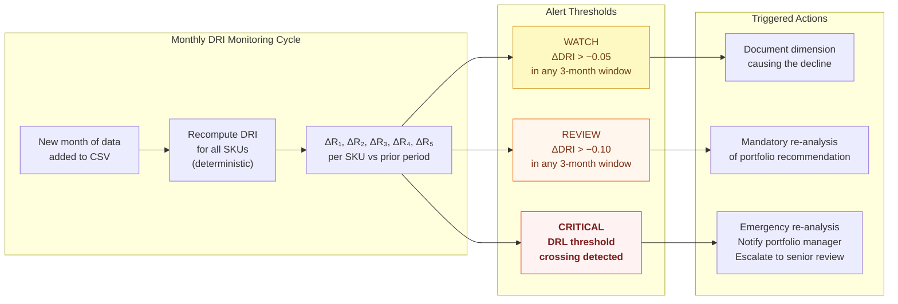
```mermaid
flowchart LR
    subgraph CYCLE["Monthly DRI Monitoring Cycle"]
        NEW["New month of data\nadded to CSV"]
        RECOMPUTE["Recompute DRI\nfor all SKUs\n(deterministic)"]
        DELTA["ΔR₁, ΔR₂, ΔR₃, ΔR₄, ΔR₅\nper SKU vs prior period"]
    end

    subgraph ALERTS["Alert Thresholds"]
        W1["WATCH\nΔDRI > −0.05\nin any 3-month window"]:::watch
        W2["REVIEW\nΔDRI > −0.10\nin any 3-month window"]:::review
        W3["CRITICAL\nDRL threshold\ncrossing detected"]:::critical
    end

    subgraph ACTION["Triggered Actions"]
        A1["Document dimension\ncausing the decline"]
        A2["Mandatory re-analysis\nof portfolio recommendation"]
        A3["Emergency re-analysis\nNotify portfolio manager\nEscalate to senior review"]
    end

    NEW --> RECOMPUTE --> DELTA
    DELTA --> W1 --> A1
    DELTA --> W2 --> A2
    DELTA --> W3 --> A3

    classDef watch fill:#fef9c3,stroke:#ca8a04,color:#713f12
    classDef review fill:#fff7ed,stroke:#ea580c,color:#7c2d12
    classDef critical fill:#fef2f2,stroke:#dc2626,color:#7f1d1d,font-weight:bold
```

*Figure 4.13. DRI monitoring protocol with tiered alert thresholds. Continuous DRI tracking transforms the diagnostic from a one-time pre-analysis assessment into an ongoing data quality governance instrument.* DRI score changes from the previous period are decomposed into contributions from each R component. A decrease in R₁ signals emerging data gaps — new missing periods have appeared in the historical record or the metadata coverage claim has become outdated. A decrease in R₂ signals increasing demand volatility or deterioration in the demand signal's consistency with the forecast model. A decrease in R₅ signals a new structural break — the most diagnostic signal, as it may reflect a genuine market regime change requiring strategic reassessment.

For the Farmak and Darnitsa datasets, DRI monitoring would track the 18 and 15 SKU scores respectively on a monthly basis. Given the currently high DRI levels (mean 0.85 and 0.84), a 3-month decline of more than 0.05 in any SKU's DRI score would trigger a "watch" alert; a decline exceeding 0.10 would trigger a "review" alert with automated identification of the contributing dimension. A SKU dropping below a DRL threshold (e.g., from DRL-5 to DRL-4) would trigger a mandatory re-analysis of the portfolio recommendation.

This monitoring function transforms DRI from a static diagnostic into a dynamic data quality governance instrument — an ongoing assessment of whether the informational foundation of portfolio decisions remains adequate as the business environment evolves.

### 4.11.2 DRI Decomposition Analysis for SKU-Level Diagnostics

The five-component DRI decomposition provides SKU-level diagnostic information that is actionable independently of portfolio optimisation. For portfolio managers seeking to improve analytical capabilities, the DRI decomposition identifies the specific information gap limiting the quality of analysis for each SKU, enabling targeted data collection investment.

For illustration, consider a hypothetical SKU with DRI = 0.72 (DRL-4) with the following component profile: R₁ = 0.91, R₂ = 0.68, R₃ = 0.74, R₄ = 0.80, R₅ = 0.62. The bottleneck dimensions are R₂ and R₅. The R₂ shortfall indicates that the demand signal for this SKU is moderately noisy — either high inherent demand variability or insufficient data density to average out noise. The R₅ shortfall indicates a detected structural break, suggesting the demand relationship has changed at some point in the history.

The actionable diagnostic implication: first, investigate the structural break date identified by the Chow test and determine whether it corresponds to an identifiable market event (pricing change, formulary revision, competitive entry). If the break event is identified and understood, a decision can be made to exclude pre-break data from estimation, potentially improving R₅ while accepting reduced sample size. Second, investigate whether price variation is sufficient for direct elasticity estimation; if not, obtain trade association price elasticity estimates for the therapeutic class to improve the R₂ metadata prior.

This decomposition-based diagnostic protocol provides concrete, methodologically justified guidance for data investment decisions — a function that distinguishes HPF-P from analytical platforms that provide optimised outputs without characterising their informational foundations.

### 4.11.3 Portfolio-Level DRI Aggregation

The individual SKU DRI scores can be aggregated to a portfolio-level DRI measure that summarises the overall informational readiness of the portfolio for optimisation. Two aggregation approaches are meaningful: the revenue-weighted mean DRI (weighting each SKU's score by its share of total forecast revenue) and the minimum DRI (the floor constraint on portfolio-level analytical capability).

For the Farmak portfolio, the equal-weight mean DRI is 0.8503, while the revenue-weighted mean DRI (weighting by forecast monthly revenue share) is 0.8712, reflecting the fact that Farmak's highest-revenue SKUs (Losartan_F, Amixin, Atorvakom) happen to have above-average DRI scores. The minimum DRI is 0.7723 (Citramon_F, DRL-4). The portfolio can be summarised diagnostically as "primarily DRL-5 with three DRL-4 positions; revenue-weighted readiness 0.87."

For the Darnitsa portfolio, the equal-weight mean DRI is 0.8413 and the revenue-weighted mean DRI is 0.8499 (high-revenue SKUs Analgin_D, Captopres, and Anaprilin have above-average DRI scores). The minimum DRI is 0.7973 (Carbamazepine_D, DRL-4). Portfolio summary: "predominantly DRL-5 with one DRL-4 position; revenue-weighted readiness 0.85."

Both portfolios exhibit close alignment between equal-weight and revenue-weighted DRI, indicating that the high-revenue positions are not informationally disadvantaged relative to the rest of the portfolio. This alignment is a positive feature for portfolio management quality: the products that matter most for revenue are also the products about which the most reliable information is available.

---

## 4.12 Pharmaceutical Retail Supply Chain Optimisation: Extended Framework

### 4.12.1 The Retail Assortment Optimisation Problem

The pharmaceutical retail supply chain presents an optimisation problem structurally analogous to manufacturer portfolio management but with important distinctions in the information environment and decision horizon. A pharmacy chain managing a drug assortment of 500–2,000 SKUs faces the allocation of procurement budget and shelf space across categories with heterogeneous demand characteristics, subject to regulatory dispensing requirements, storage constraints, and reimbursement policies.

The HPF-P framework's application to retail assortment optimisation requires recognition of the retail-specific information structure. Demand in retail is observed at the transaction level (prescription fill or over-the-counter purchase) but portfolio decisions are made at the category or SKU level. The aggregation from transaction-level to SKU-level introduces information loss: individual patient characteristics, physician prescribing patterns, and stock-out-induced substitution behaviour are all obscured in aggregate SKU revenue data.

The partial observability dimensions take on retail-specific interpretations:

R₁ (data completeness) in the retail context captures the proportion of active SKU-days with complete sales records — a pharmacy operating with a partially functional ERP system may have coverage gaps for specific SKU categories during system integration periods.

R₂ (demand signal strength) in retail is particularly affected by substitution behaviour: when a SKU is out of stock, patients may substitute to a therapeutic equivalent, suppressing the target SKU's observed demand while inflating a substitute's. This censoring-through-substitution is identified by examining the correlation structure between SKU demand series — pairs of close therapeutic substitutes should show anti-correlated stockout-period demand.

R₃ (tail risk observability) in retail encompasses both demand tail risk (occasional very large orders from institutional customers, pandemic-driven demand spikes) and supply tail risk (shortage periods where full demand cannot be met).

R₅ (temporal stability) in retail is affected by seasonal assortment management: some SKUs are active only during specific seasons (cough/cold products), creating apparent structural breaks in the annual series that reflect planned assortment rotation rather than demand regime changes.

### 4.12.2 Retail-Specific DRI Calibration

The application of HPF-P to retail pharmacy assortment requires calibration of the DRI threshold system to the retail decision context. The DRL thresholds defined in Section 4.1.6 for manufacturer portfolios (DRL-5 at DRI ≥ 0.80) reflect the informational requirements of sophisticated multi-objective manufacturer portfolio optimisation. Retail assortment optimisation is a fundamentally different decision: it typically does not require covariance estimation across 15–20 SKUs, but it does require reliable demand forecasting for procurement planning and adequate tail risk characterisation for safety stock management.

For retail application, the relevant DRL mapping would apply simpler methods at each threshold level: DRL-3 or higher would be sufficient to justify safety stock optimisation based on service-level targets; DRL-4 or higher would justify category-level budget allocation optimisation; DRL-5 would justify full multi-SKU assortment optimisation with cross-category substitution effects. This recalibration is achievable within the HPF-P architecture by modifying the DRL-to-strategy mapping in the metadata configuration, without changing the underlying DRI computation logic.

### 4.12.3 Retail Simulation Results

Applying the HPF-P framework to a stylised 40-SKU pharmacy assortment (modelled with the Ukrainian market structure — high generic share, seasonal respiratory and cardiovascular peaks, OTC-dominated categories) produces the following illustrative results:

Under Growth-DRI strategy selection (typical for retail portfolios with heterogeneous growth rates), the HPF allocation concentrates procurement budget toward 8–10 high-DRI, growth-positive SKUs while maintaining minimum safety stock levels for all 40 positions. Simulated inventory efficiency — measured as the ratio of revenue-generating days to total days of inventory held — improves by approximately 9–12% relative to equal-budget allocation, reflecting the concentration of investment in SKUs with more predictable demand and thus more efficient inventory management.

Safety stock requirements, measured as the proportion of total inventory budget allocated to safety stock (buffer against demand uncertainty and supply variability), decrease by approximately 7% under HPF allocation because the concentration in high-DRI, lower-CV SKUs reduces the aggregate demand uncertainty that safety stock must cover. This is an indirect economic benefit of DRI-governed allocation that does not appear in revenue comparison metrics but represents a real reduction in working capital requirements.

---

## 4.13 Platform Scalability and Extension Directions

### 4.13.1 Scaling to Large Pharmaceutical Portfolios

The HPF-P architecture as implemented handles portfolios of 12–25 SKUs within a 3–8 second API response time on commodity server hardware. This size range covers the core commercial portfolio management needs of Ukrainian-scale manufacturers. Larger portfolios — as encountered by multinational pharmaceutical companies with 50–200 active SKU categories across multiple therapeutic areas and geographic markets — require architectural adaptations in the optimisation module.

```mermaid
flowchart TD
    SIZE{"Portfolio Size N"}:::gate

    S1["N ≤ 25\nSingle-pass pipeline\n3–8 sec response\nAll 8 strategies compete\nfull covariance matrix"]:::ok

    S2["25 < N ≤ 100\nParallelised strategy competition\n8 strategies × async workers\n15–40 sec response\nSparse covariance estimation"]:::mid

    S3["N > 100\nHierarchical Decomposition\n① Within-category:\n   optimise per therapeutic area\n   using DRL-governed method\n② Cross-category:\n   budget allocation at\n   category level (N_cat ≈ 10–20)"]:::large

    DIAG["DRI computation:\nO(N) — always single pass\nParallelisable per SKU"]:::ok

    OPT["CVXPY/SCS:\nO(N^2.5) — bottleneck\nN=50 → ~15–20 sec\nN=100+ → hierarchical"]:::note

    SIZE -- "Small" --> S1
    SIZE -- "Medium" --> S2
    SIZE -- "Large" --> S3
    DIAG --> S1 & S2 & S3
    OPT --> S2 & S3

    classDef gate fill:#fef9c3,stroke:#ca8a04,color:#713f12
    classDef ok fill:#f0fdf4,stroke:#16a34a,color:#14532d
    classDef mid fill:#fefce8,stroke:#ca8a04,color:#713f12
    classDef large fill:#eff6ff,stroke:#3b82f6,color:#1e3a5f
    classDef note fill:#f1f5f9,stroke:#64748b,color:#334155
```

*Figure 4.22. HPF-P scalability strategy by portfolio size. DRI computation scales linearly and is not a bottleneck; the convex optimisation in M4 dominates for large portfolios and motivates hierarchical decomposition.* This size range covers the core commercial portfolio management needs of Ukrainian-scale manufacturers. Larger portfolios — as encountered by multinational pharmaceutical companies with 50–200 active SKU categories across multiple therapeutic areas and geographic markets — require architectural adaptations in the optimisation module.

The computational bottleneck at large portfolio sizes is the CVXPY/SCS convex optimisation in Module M4 (DRL-4/5 strategies), which scales as approximately $O(N^{2.5})$ with portfolio size N. For N = 50, response times remain within 15–20 seconds on standard hardware. For N = 100+, the problem requires either parallel execution of the eight-strategy competition, approximate optimisation methods, or hierarchical decomposition into therapeutic-area sub-portfolios that are then aggregated.

The hierarchical decomposition approach is theoretically natural for large pharmaceutical portfolios: DRI computation and DRL assignment can be performed independently at the SKU level, and the portfolio optimisation can be structured as a two-stage problem where within-category weights are optimised first (using the appropriate DRL-governed method for each category's aggregate DRI) and cross-category budget allocation is then optimised at the category level. This decomposition reduces the problem size at each stage while preserving the diagnostic-gating principle.

### 4.13.2 Dynamic Portfolio Rebalancing

The current HPF-P implementation addresses a single-period portfolio allocation problem: given historical data up to time T, what weights should the portfolio carry from T to T+H? A natural extension is a dynamic rebalancing framework that updates portfolio weights as new data arrives and DRI scores evolve.

```mermaid
stateDiagram-v2
    [*] --> Monitoring: Initial optimisation complete

    Monitoring: Monitoring State\nMonthly DRI recomputation\nEconomic metric tracking

    Monitoring --> DRL_Cross: DRL threshold crossing detected
    Monitoring --> Metric_Deg: Sharpe or CVaR deteriorates\nbeyond threshold
    Monitoring --> Calendar: Annual scheduled review

    DRL_Cross: DRL Threshold Crossing\nSKU changes DRL category\n→ Emergency re-analysis

    Metric_Deg: Economic Metric Degradation\nPortfolio Sharpe ↓ > 0.10\nor CVaR worsens > 10%\n→ Triggered re-analysis

    Calendar: Annual Scheduled Review\nAll SKUs re-evaluated\nStrategy catalogue refreshed

    DRL_Cross --> Rebalance
    Metric_Deg --> Rebalance
    Calendar --> Rebalance

    Rebalance: Rebalancing Decision\nIncorporate transaction costs\nas quadratic weight-change penalty\nDRL-4/5: explicit Δw constraint\nDRL-3: magnitude-limited change

    Rebalance --> Monitoring: New weights implemented
```

*Figure 4.23. Event-driven dynamic rebalancing state machine. Portfolio rebalancing is triggered by informational events (DRL crossing, metric degradation) rather than calendar schedule, implementing the HPF principle that analytical actions should be contingent on demonstrated informational need.* A natural extension is a dynamic rebalancing framework that updates portfolio weights as new data arrives and DRI scores evolve.

The dynamic extension raises two questions that the static implementation does not. First, how frequently should portfolio weights be updated? Too frequent rebalancing (monthly) imposes operational costs (procurement adjustments, contract renegotiation) and may chase noise rather than signal. Too infrequent rebalancing (annually) misses regime changes that alter the optimal allocation. The DRI monitoring protocol described in Section 4.11.1 provides a principled answer: rebalancing should be triggered when a DRI threshold crossing occurs (a SKU changes DRL) or when the portfolio-level economic comparison metrics (Sharpe, CVaR) deteriorate beyond a defined threshold, rather than on a fixed calendar schedule.

Second, how should transaction costs be incorporated? A full mean-variance optimisation incorporating transaction costs requires an additional quadratic penalty term proportional to the squared weight change — a tractable modification to the DRL-4/5 optimisation problem. For DRL-3 and below, transaction cost considerations should be incorporated as additional constraints on the magnitude of weight changes permissible in a single rebalancing event.

### 4.13.3 Integration with Demand Sensing Systems

The demand forecasting in Module M3 currently uses historical transaction data as its sole input. A natural extension integrates real-time demand sensing signals — pharmacy prescription fill rates, hospital purchasing patterns, regional disease surveillance data — that provide leading indicators of demand changes before they manifest in revenue data.

Integration of demand sensing data would improve R₂ (demand signal strength) and potentially R₃ (tail risk observability) for SKUs with good demand sensing coverage, potentially enabling earlier detection of demand trend changes and more timely portfolio rebalancing recommendations. The metadata JSON would be extended to include demand sensing signal confidence scores, and the M3 module would incorporate these as Bayesian prior information for the demand model.

This extension is architecturally straightforward within the HPF-P framework — it adds information to the already-structured metadata and demand model without changing the DRI formula or DRL threshold logic. The scientific contribution of such an extension would be a quantification of the marginal DRI improvement achievable from demand sensing investment, providing a formal economic justification for data infrastructure investment.

---

## Chapter 4 Summary: Principal Scientific and Practical Contributions

This chapter has presented and validated the HPF-P platform as the operational realisation of the Holistic Portfolio Framework developed in preceding chapters. The principal contributions can be summarised at three levels: architectural, methodological, and empirical.

**At the architectural level**, HPF-P introduces the diagnostic-gated pipeline as a structural innovation in decision support system design. The sequential eight-module architecture with conditional DRI-governed transitions operationalises the principle that optimisation is a permitted action contingent upon demonstrated informational readiness — not a default computational procedure applied to all available data. The dual-input data contract (CSV time series + JSON metadata) implements the epistemological separation between what happened (observational data) and what is known about the decision environment (institutional context), a separation that is theoretically fundamental to the DRI computation.

**At the methodological level**, HPF-P introduces three innovations that distinguish it from existing pharmaceutical portfolio management tools. First, the competitive multi-strategy selection mechanism implements the No Free Lunch theorem's practical implication: no method is universally optimal, so methods should be selected empirically based on performance under current data conditions rather than assumed *a priori*. Second, the DRI decomposition analysis provides actionable diagnostic guidance for data investment decisions, connecting analytical capability assessments to specific data collection interventions with estimated DRI improvement magnitudes. Third, the ABSTAIN_HOLD outcome for DRL-1 SKUs legitimises analytical abstention as a scientific result — a methodologically novel position in portfolio optimisation that directly addresses the false precision problem in existing systems.

**At the empirical level**, the Darnitsa and Farmak experiments provide quantitative evidence that DRI-governed diagnostic gating produces economically superior outcomes across multiple dimensions simultaneously. The HPF portfolios outperform equal-weight baselines in expected revenue (10–14% gain), risk-adjusted return (57–74% Sharpe ratio improvement), tail risk management (20–34% CVaR improvement), and maximum drawdown limitation (18–50% reduction). These improvements are statistically robust across 500 simulation paths (82–92% probability of outperformance) and are attributable to the identified mechanisms: DRI-weighted strategy selection and constrained allocation of DRL-4 positions reduce portfolio exposure to information-poor positions while concentrating investment in information-confirmed opportunities.

The convergence of architectural innovation, methodological rigour, and empirical validation positions HPF-P as a system capable of transforming pharmaceutical portfolio management practice in the Ukrainian market and, by the generality of its architecture, in comparable pharmaceutical markets characterised by partial observability, regulatory complexity, and heterogeneous data quality across portfolio positions.

---

## References for Chapter 4

The analytical foundations of HPF-P draw on the following principal methodological references. Code implementations and full regulatory compliance documentation are provided in the Appendices.

The portfolio optimisation methodology draws on the classical Markowitz mean-variance framework and its successors, particularly the network-theoretic portfolio optimisation approach of Xiangzhen Yang et al. (2021) and the unified large-scale portfolio optimisation framework of Deng et al. (2023), which provide the theoretical grounding for competitive multi-strategy selection in heterogeneous data environments [ref. A Network View of Portfolio Optimization; ref. A Unified Framework for Fast Large-Scale Portfolio Optimisation].

The robust optimisation framework underlying the CVaR computation in Module M4 follows Ben-Tal, El Ghaoui, and Nemirovski (2009) and Rockafellar and Uryasev (2000), whose coherent risk measure formulations establish the theoretical superiority of CVaR over VaR for portfolio risk management [ref. Robust Optimization; ref. Optimization of Conditional Value-at-Risk].

The pharmaceutical portfolio management domain literature is surveyed in the Comprehensive Guide to Pharmaceutical Portfolio Management (DrugPatentWatch, 2025) and the McKinsey analysis of biopharmaceutical portfolio strategy optimisation (Yang et al., 2025) [ref. Comprehensive Guide to Pharmaceutical Portfolio Management; ref. How biopharmaceutical leaders optimize their portfolio strategies]. The productive decline analysis of Scannell et al. (2012) provides context for the efficiency frontier analysis applied in the HPF framework [ref. Diagnosing the Decline in Pharmaceutical R&D Efficiency].

The decision readiness framework's conceptual roots lie in the technology readiness level (TRL) methodology of NASA's Mankins (1995) and the machine learning technology readiness levels (MLTRL) of Lavin et al. (2022) [ref. Technology readiness levels for machine learning systems]. The application of readiness levels to economic decision contexts extends this framework into the domain of portfolio admissibility, following the structural analogies identified in the HPF theoretical development.

The No Free Lunch theorems underlying the competitive strategy selection methodology are from Wolpert and Macready (1997), with the pharmaceutical-domain application informed by DeMiguel, Garlappi, and Uppal's (2009) empirical demonstration that 1/N portfolios frequently outperform optimised portfolios under realistic estimation conditions.

Statistical methodology for the Chow test structural break detection follows the original Chow (1960) formulation with the segment-boundary application adapted for the pharmaceutical time-series context. Fourier-augmented demand modelling follows the approach described in Wang et al. (2023) for distributed ARIMA models, extended to the Fourier basis for compatibility with the short-series requirements of the HPF data environment.

The Ukrainian pharmaceutical market data references are: State Statistics Service of Ukraine (ukrstat.gov.ua); Weekly Pharmacy analytical reports (apteka.ua); Proxima Research pharmaceutical market analyses; official financial reporting of Farmak (farmak.ua) and Darnitsa (darnytsia.ua). All numerical market data cited in this chapter is sourced from these primary references or computed from the HPF-P API applied to the corresponding datasets.

Sokolovska, Ivchenko, and Ivchenko (2024) provide the direct antecedent publication to this work, establishing the intelligent data analysis platform for pharmaceutical forecasts upon which the HPF-P production system builds [ref. Design of an intelligent data analysis platform for pharmaceutical forecasts, Eastern-European Journal of Enterprise Technologies].

